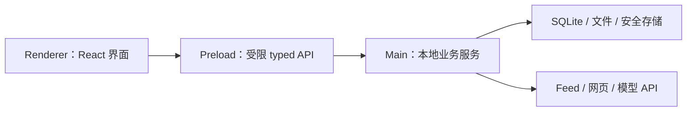

# Shale：本地优先 AI Feed 阅读器

## 一句话目标

构建一个本地优先、以阅读为中心的跨平台桌面 Feed 阅读器，让用户能够获取、清洗、保存和离线阅读文章，并使用自己配置的模型生成摘要与翻译。

## 1. 产品定位

Shale 面向希望集中阅读博客、独立网站和其他 Feed 内容，同时又重视本地数据所有权与 AI 可控性的用户。

产品的主体是订阅与阅读。AI 是辅助用户理解文章的能力，不是独立聊天产品，也不应阻塞基本阅读流程。

### 核心用户需求

- 用一个桌面应用管理和刷新 Feed；
- 将文章正文提取、清洗并保存在本机；
- 在简洁、稳定的 Reader 中阅读，并在断网或重启后恢复；
- 在需要时调用用户自行配置的模型生成 Summary 和 Translation；
- 清楚了解同步、清洗和 AI 任务当前处于什么状态；
- 不注册账号，不把订阅、正文、阅读状态和 AI 结果默认上传到项目自建服务。

## 2. 产品原则

1. **本地优先**：订阅、文章、阅读状态、配置和 AI 结果默认保存在用户本机；已保存内容在断网时仍可读取。
2. **阅读优先**：Feed 获取、正文清洗和 Reader 构成产品主路径，AI 只能增强而不能替代它。
3. **简洁克制**：界面重点呈现来源、文章、状态和当前可执行操作，避免无关装饰与多余层级。
4. **状态透明**：同步、清洗、生成、失败和恢复均应有明确状态；耗时操作不能表现为无响应。
5. **用户可控**：模型、API Key、同步和 AI 调用由用户明确配置或触发；失败时提供可理解的反馈。
6. **跨平台一致**：Windows 11 与原生 Wayland 保持相同核心流程，允许少量符合平台能力的表现差异。
7. **渐进交付**：优先保证可重复验证的端到端闭环，再增加辅助功能和体验打磨。

## 3. 核心用户流程

1. 用户启动应用并添加一个 Feed，或从 OPML 导入订阅；
2. 应用手动或定时同步 Feed，解析并去重文章；
3. 用户打开文章，应用获取原文、提取正文并生成 Cleaned HTML / Markdown；
4. 清洗结果和文章元数据写入本地数据库，Reader 展示可读正文；
5. 用户可以在 Reader / Web / Dual 模式间切换；
6. 阅读状态保存到本机，应用重启或网络断开后仍可恢复已保存文章；
7. 用户配置 Provider、模型和 API Key；
8. 用户针对文章生成 Summary 或 Translation；
9. 应用显示任务状态，并将最终 AI 结果保存到本机；
10. 用户再次打开文章时直接读取已有结果，不重复产生不必要的模型调用。

## 4. 功能范围

### P0：必须完成

#### 工程与本地基础

- Electron / React / TypeScript / Vite / Forge 基础工程；
- Main / Preload / Renderer 进程边界与安全窗口配置；
- 最小 typed IPC、统一错误格式和基础事件机制；
- SQLite 初始化、迁移、核心数据模型与 Store 规范；
- Windows 11 与原生 Wayland 的可运行构建和关键验证。

#### Feed 与内容管线

- 添加和管理 Feed；
- RSS / Atom 的基础解析；
- 手动 Sync、定时 Sync、去重和错误处理；
- OPML 导入/导出；
- 单篇网页获取、正文提取与清洗；
- 生成并持久化 Cleaned HTML / Cleaned Markdown；
- 清洗失败时保留访问原文或 Web 视图的路径。

#### Reader

- 文章列表与文章打开流程；
- Reader / Web / Dual 三种阅读模式；
- 基础阅读状态；
- 本地内容恢复与离线读取；
- 核心 Loading、Empty 和 Error 状态。

#### AI

- Provider、模型和 API Key 配置；
- API Key 不写入普通配置、日志或仓库；
- 最小 AI 任务状态、流式事件隔离和错误处理；
- Summary 基础版本；
- Translation 基础版本；
- AI 结果持久化与重启恢复。

#### 质量与交付

- 核心数据、Store、内容契约和任务状态具有自动化测试；
- 最低端到端流程具有可重复的人工验收记录；
- Windows 11 与原生 Wayland 至少各完成一次完整冒烟测试；
- 应用能够从干净环境启动或安装，并完成演示。

### P1：完成 P0 后按容量选择

- 搜索；
- 主题与多语言基础支持；
- 完整的取消、重试、并发限制和用量记录；
- 笔记与单篇导出；
- 日志与诊断导出；
- 更完整的空状态、错误状态和恢复交互。

当前周期最多选择一至两项 P1。P0 存在未关闭的高风险时，不启动新的 P1。

### P2 / Stretch

- 多篇文摘导出；
- 手动标签、AI 标签、批量标签和完整标签管理；
- 高级主题与多语言打磨；
- Translation 分段并发、局部失败和局部重试；
- 非关键性能优化。

## 5. 非目标

首个交付周期不承诺：

- 账号系统和项目自建云服务；
- 多设备云同步与冲突合并；
- 对所有网站都达到完美正文提取；
- 无限制并发的 AI 任务系统；
- Translation 的高级分段并发和局部恢复；
- 完整实现全部辅助功能；
- 为视觉创新而偏离老师给出的简洁阅读器方向。

## 6. 架构原则

### Renderer

- 负责页面、交互和当前界面状态；
- 不直接访问数据库、文件系统、密钥或 Electron/Node 高权限 API；
- 只通过 Preload 暴露的 typed API 请求 Main 执行业务操作。

### Preload / IPC

- Preload 仅暴露经过白名单限制的最小接口；
- 共享 TypeScript 契约定义请求、响应、错误和事件；
- Feed、Reader 和 AI 使用各自命名空间；
- 公共 IPC 只统一规则和基础模式，不集中实现全部功能接口。

### Main

- 负责 Feed/网页网络请求、内容清洗、SQLite、文件、密钥和模型 API；
- IPC Handler 保持薄层，业务逻辑进入 Service，持久化逻辑进入 Store；
- 功能模块拥有自己的表、迁移、Store、IPC、页面与测试。

## 7. 核心数据与接口边界

### 主要实体

- `Feed`：订阅源及同步信息；
- `Entry`：文章元数据、来源和去重标识；
- `RawContent`：必要的原始获取结果；
- `CleanedContent`：Cleaned HTML、Cleaned Markdown 和可选 segment 信息；
- `ReadState`：已读状态和 Reader 恢复信息；
- `ProviderConfig`：不含明文密钥的模型配置；
- `AIRun`：AI 任务身份、类型、状态和错误；
- `Summary` / `Translation`：生成结果及其文章关联；
- `Usage`：Provider 可提供时记录的基础用量信息。

### Cleaned Content 契约

内容管线是生产者，Reader 和 AI 是消费者。契约至少需要表达：

- 文章身份、标题、来源和原始 URL；
- Cleaned HTML 与 Cleaned Markdown；
- 内容版本或更新时间；
- 可选的段落/segment ID、顺序和文本，用于 Translation 对齐；
- 清洗状态、失败信息和原文回退信息。

契约在 M0 形成 v0，并由三方 Review。消费者不得依赖内容管线的内部实现。

### AI 任务最低状态

- `running`：已启动或正在接收输出；
- `succeeded`：最终结果已完成并持久化；
- `failed`：任务失败并返回结构化错误。

任务必须使用 `runId` 与文章身份隔离，避免切换文章或并发操作时串线。完整取消、重试和并发治理属于 P1；P0 先保证单任务路径正确、可恢复。

## 8. 技术栈与开发环境

- 桌面框架：Electron；
- Renderer：React + TypeScript；
- 构建与开发：Vite；
- 打包：Electron Forge；
- 本地数据库：SQLite；
- 通信：Electron Preload + typed IPC；
- 网络与模型：Main 进程内的 Feed、Content 与 Provider Service；
- 目标平台：Windows 11、原生 Wayland Linux；
- 产品名与 npm package name：Shale / `shale`；后续 `package.json` 必须设置 `"private": true`；
- 运行时：团队使用 Node.js 24.x LTS；首次工程初始化环境为 Node.js 24.11.1；
- 包管理器与锁文件：只使用 npm，唯一锁文件为提交到仓库的 `package-lock.json`，不得混用其他锁文件；锁文件产生后，其他成员优先使用 `npm ci` 安装依赖；
- 测试：通过仓库 `package.json` 中统一脚本执行单元、集成和必要的端到端验证。

SQLite 驱动、密钥存储实现和测试库属于需要通过 M0 原型验证的实现选择；无论选择何种库，都不得改变本文件规定的边界、持久化目标和安全约束。

## 9. 最低验收标准

P0 只有同时满足以下条件才算完成：

1. 可以在 Windows 11 和原生 Wayland 启动应用；
2. 可以添加 Feed、手动同步并得到无重复的文章列表；
3. 可以获取、清洗、持久化并在 Reader 中展示一篇真实文章；
4. 可以切换 Reader / Web / Dual 模式；
5. 重启或断网后仍可阅读已保存内容并恢复阅读状态；
6. 可以导入/导出 OPML，并验证一次定时 Sync；
7. 可以配置 Provider、模型和 API Key；
8. 可以生成、显示、保存并恢复 Summary 与 Translation；
9. 无效 Feed、网络失败和模型失败不会导致应用崩溃，并有可理解提示；
10. 关键模块有可重复的自动化或人工验证方式；
11. 可以从干净环境启动或安装并完整演示上述流程。

## 10. 文档关系

- `INIT.md`：产品目标、范围、核心体验和不可突破的约束；
- `AGENTS.md`：所有人和 Coding Agent 必须遵守的工程、协作和质量规则；
- `PLAN.md`：里程碑、依赖、负责人、验收门和滚动任务计划；
- GitHub Issues：当前任务的具体目标、设计、影响范围和验证方式；
- 协议/ADR 文档：关键契约与重大技术决策的专门记录。

产品目标或 P0 发生变化时先更新本文件，再同步调整 `PLAN.md` 与相关 Issues。