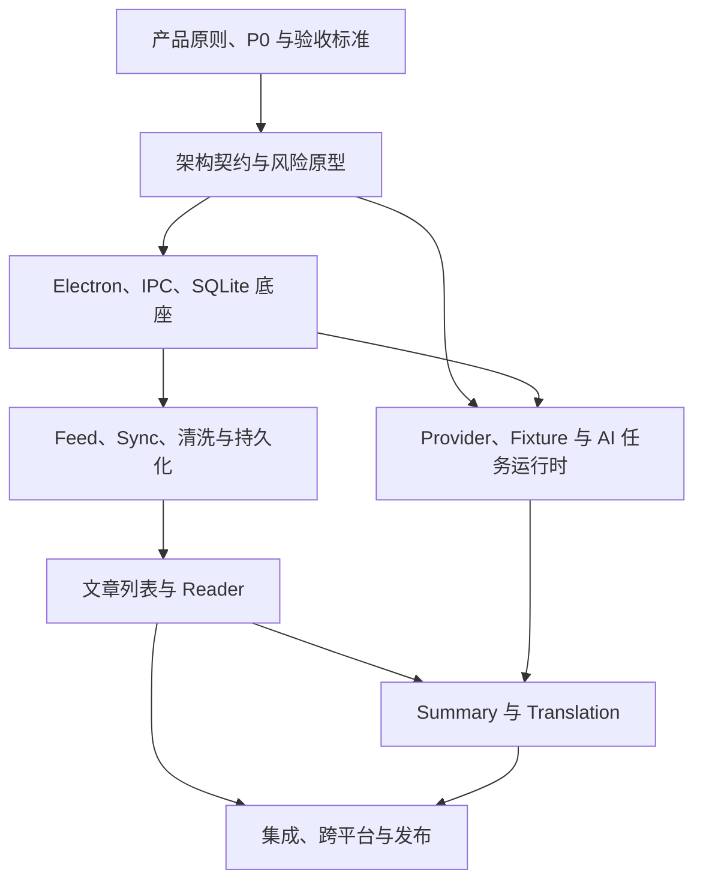

# PLAN.md

> 状态：Baseline v1（依据团队已确认的成本、依赖与风险分析生成）  
> 计划周期：3～4 周；以下以 4 周为基线，并使用相对周次  
> 维护方式：滚动规划——当前里程碑细化为 Issues，后续里程碑保留工作包级，上一里程碑验收后再拆细

## 1. 计划目标

在最终截止前交付一个本地优先、以阅读为中心的跨平台桌面 Feed 阅读器。用户能够添加和同步 Feed、阅读本地持久化的清洗正文，并使用自己配置的模型生成和保存 Summary 与 Translation。

计划优先保证完整、可重复演示的端到端闭环，而不是孤立功能的数量。

### P0：必须完成

- Electron / React / TypeScript / Vite / Forge 基础工程；
- 安全窗口、Preload、最小 IPC 与 SQLite 基础；
- 添加 Feed、手动 Sync、去重和文章列表；
- 单篇文章获取、清洗、持久化与 Reader 展示；
- 基础阅读状态与离线读取；
- Provider、模型与 API Key 配置；
- 最小 AI 任务状态与错误处理；
- Summary 与 Translation 基础版本；
- AI 结果持久化；
- OPML 导入/导出；
- 定时 Sync；
- Reader / Web / Dual 模式完整切换；
- 关键测试、Windows 11 / 原生 Wayland 验证和可运行构建。

### P1：完成 P0 后按剩余容量选择

- 搜索；
- 主题与多语言基础支持；
- 完整的取消、重试、并发限制和用量记录；
- 笔记与单篇导出；
- 日志与诊断导出；
- 更完整的空状态、错误状态和恢复交互。

P1 不预先承诺全部完成。M2 验收时，根据 P0 剩余工作量最多选择一至两项进入当前周期。

### P2 / Stretch

- 多篇文摘导出；
- 手动、AI 与批量标签及完整标签管理；
- 高级主题与多语言打磨；
- Translation 分段并发、局部失败与局部重试；
- 非关键性能优化。

P2 不得挤占 P0 测试、跨平台验证和发布时间。

## 2. 负责人和边界

### cyn / 产品与 Reader 负责人

- 需求、整体交互、计划、验收和集成协调；
- Electron 应用外壳、基础导航和通用界面规范；
- SQLite 初始化、迁移机制、核心数据模型和 Store 规范；
- 公共 IPC 的命名、类型、错误、安全和事件规范；
- Reader、阅读状态、离线读取及对应 Store、IPC 和页面；
- 对公共契约和整体交互进行 Review，但不默认接管其他模块的实现。

### qyt / Feed、内容管线负责人

- Feed 添加、解析、持久化和去重；
- OPML 导入/导出、手动和定时 Sync；
- 网页获取、正文提取与清洗；
- Cleaned HTML / Markdown；
- Feed、Entry、Raw/Cleaned Content 的表、迁移、Store、IPC、错误处理和相关页面。

### cyj / AI 功能负责人

- Provider、模型配置和 API Key 安全存储；
- AI 共享流式任务运行时；
- Summary、Translation 和基础用量记录；
- AI Run、Summary、Translation、Usage 的表、迁移、Store、IPC、错误处理和相关页面。

### 公共模块协作规则

- 公共基础负责人提供规则、最小实现和示例，不代写全部功能接口；
- 每位功能负责人实现并测试本模块的表、Store、IPC 和页面；
- Cleaned Content 契约由 Feed / 内容管线负责人起草，Reader 与 AI 负责人以消费者身份共同 Review，组长负责收敛到公共类型；
- 修改公共 IPC、核心 Schema、Cleaned Content 契约或应用入口前，必须先在对应 Issue 中说明影响并通知受影响成员；
- 每个人都负责自己模块的自动化测试、人工验证和必要文档。

## 3. 计划粒度

### Issue 粒度

- 一个普通 Issue 以 **0.5～2 个理想开发日**为宜；
- 超过 2 天或同时包含多个独立验收结果时，应继续拆分；
- 小于 0.5 天且不能独立验收的工作，合并到相邻 Issue 的检查项；
- 一个 Issue 必须产生可观察结果，例如通过测试、可运行原型、可演示页面或稳定契约，不能只写“完善某模块”；
- 每人同时只保留一个主要实现 Issue 处于 `In Progress`，Review 和紧急修复除外。

### 每个 Issue 至少包含

- 目标与负责人；
- 范围内 / 范围外；
- 前置依赖和会阻塞谁；
- 接口、Fixture 或测试环境需求；
- 验收标准与验证方法；
- 若涉及公共契约，列出需要 Review 的成员。

### 滚动细化

- M0 和 M1 在开工时拆成可领取的 Issues；
- M2 在 M1 验收后拆细；
- M3 在 M2 验收并完成 P0 余量判断后拆细；
- M4 只从测试结果、平台验证和发布清单生成 Issues，不提前制造大量猜测性任务。

## 4. 关键依赖与解耦方式

为避免某一人等待另一人完成整条链路：

- Reader 先使用固定 Cleaned HTML / Markdown Fixture；
- AI 先使用固定 Cleaned Markdown、segment 示例和 Mock Provider；
- 内容管线先通过测试或调试入口验证，不等待完整页面；
- 各模块先依赖共享 TypeScript 类型，不直接依赖另一模块的内部实现；
- 数据库公共基础只提供连接、迁移和 Store 规范，功能表和 Store 由各负责人完成；
- 真正串联前，Fixture 与真实输出必须通过同一份契约测试。

## 5. 里程碑安排

以下周次从正式开工日 `D0` 起算。若总周期只有 3 周，M2 与 M3 压缩合并，并自动取消所有未开始的 P1；最后 5 天的 M4 不压缩。

### M0：范围、契约与风险消减（D0～D2）

目标：让三人能够在明确边界下并行开发，并尽早暴露会推翻计划的技术风险。

#### 当前应创建的 Issues

| Issue | 负责人 | 交付结果 | 停止点 / 等待项 |
|---|---|---|---|
| M0-01 工程空壳与开发入口 | 组长 | Electron/React/TS/Vite/Forge 可启动，基础目录和脚本可用 | 空壳合入后，其他成员再基于统一工程开展正式实现 |
| M0-02 SQLite、Preload 与 IPC 最小原型 | 组长 | 写入、读取、重启恢复；普通请求和事件各跑通一个示例 | 只做到证明方案和形成规范，不扩写功能 IPC |
| M0-03 Cleaned Content 契约与 Fixture | Feed 主责；Reader、AI Review | 共享类型、示例文章、HTML/Markdown 与可选 segment 信息，三方确认 | 契约 v0 合并后，生产者和消费者分别实现；变更走契约 Review |
| M0-04 Feed、去重与正文提取风险原型 | Feed 负责人 | RSS/Atom 和代表性网页样例的解析、去重、正文提取结论 | 到时限即停止；记录支持边界和降级方案，不追求覆盖所有网站 |
| M0-05 Provider、流式任务与 Key 存储原型 | AI 负责人 | Provider 可行性、Mock/真实流式事件和目标平台 Key 存储结论 | 到时限即停止；复杂取消、恢复和并发不在本原型展开 |
| M0-06 双平台空壳冒烟 | 全体；平台执行人待补 | Windows 11 与 Wayland 的启动、路径、网络、SQLite 和基础 UI 记录 | 任一平台阻塞 P0 时先修底座，不继续叠加功能 |

#### M0 验收门

- 三人能从统一工程启动应用；
- SQLite 与最小 IPC 方案经过验证；
- Cleaned Content 契约 v0 和 Fixture 可供 Reader、AI 独立开发；
- Feed/清洗、AI 流式、Key 存储和跨平台风险均有结论或明确降级；
- 根据原型结果修正后续里程碑，不把原估算当作承诺继续硬推。

### M1：最小阅读闭环（第 1 周结束前）

目标：真实走通“添加 Feed → 同步 → 清洗 → 持久化 → Reader 展示”的最短链路，同时让 AI 基础独立可测。

#### M1 工作包（M0 验收后拆成 Issues）

| 工作包 | 负责人 | 验收结果 |
|---|---|---|
| 应用外壳、基础导航与通用状态组件 | 组长 | 页面可切换，Loading/Empty/Error 有最小一致表现 |
| 数据库迁移、核心实体与 Store 测试基础 | 组长 | 可迁移、回滚开发数据、读写并重启恢复；模块可按规范扩展 |
| Feed 添加、解析、手动 Sync、去重与持久化 | Feed 负责人 | 添加测试 Feed 后得到文章；重复 Sync 不产生重复记录 |
| 单篇正文获取、清洗与 Cleaned Content 持久化 | Feed 负责人 | 真实文章生成契约规定的内容并写入数据库 |
| Reader Fixture/真实数据展示与阅读状态 | 组长 | Fixture 和真实清洗结果均可展示，已读状态可保存 |
| Provider/模型配置与最小连接测试 | AI 负责人 | 配置可保存，Key 不进入普通配置或日志，可得到成功/失败结果 |
| Mock Provider 与最小 AI 任务状态 | AI 负责人 | `start → chunk → success/failure` 可重复验证，不与 Feed 实现耦合 |
| 首次阅读链路集成 | 全体 | 从添加 Feed 到 Reader 展示完整走通，并完成双平台冒烟 |

#### M1 验收门

- 最低阅读闭环使用真实 Feed 和真实正文走通；
- 断网或重启后可重新打开已保存文章；
- AI 可基于 Fixture 独立运行最小任务；
- 公共契约与真实输出一致；
- 若最小闭环仍未完成，M2 不启动 P1 或视觉打磨。

### M2：核心功能稳定化（第 2 周）

目标：补齐阅读链与 AI 基础，使 P0 的剩余风险从“架构未知”转为“明确实现和测试工作”。

#### 工作包

- **Feed / 内容管线**：Feed 管理、同步状态和错误处理；OPML 导入/导出；定时 Sync 的最小可靠版本；清洗失败时的原文/Web 回退；
- **Reader**：文章列表衔接、Reader / Web / Dual 切换、阅读状态、离线恢复和关键空/错状态；
- **AI**：Provider 与 Key 配置稳定化；任务 ID、事件隔离、失败状态和基础持久化；Summary 基础链路；
- **全体**：第二次端到端集成、Schema/IPC 契约检查、Windows/Wayland 冒烟和一次小规模结构整理。

#### M2 验收门

- P0 的 Feed、Reader 和 AI 基础均有真实可运行路径；
- Summary 能对真实 Cleaned Content 生成、显示、保存并在重启后恢复；
- OPML、定时 Sync 和三种阅读模式达到基础可演示状态；
- 根据剩余容量决定是否加入最多一至两项 P1；P0 有红色风险时不加入 P1。

### M3：完整 P0 与功能冻结（第 3 周至最终截止前 5 天）

目标：完成 Translation 和所有剩余 P0，关闭端到端缺口。

#### 工作包

- Translation 基础版：优先短文章、串行处理、完整结果持久化；
- Summary / Translation 的关键失败提示与结果恢复；
- 补齐 OPML、定时 Sync、Reader/Web/Dual 中尚未通过验收的项目；
- 只实现 M2 明确选中的 P1，不临时追加辅助功能；
- 完成一次完整演示流程、数据持久化、重启恢复和双平台回归；
- 最终截止前 5 天进入功能冻结。

#### M3 验收门

- P0 所有条目均有可重复的验证记录；
- 从干净环境可以启动或安装并走通最低演示流程；
- 未通过的 P0 有负责人、修复 Issue 和可接受的降级方案；
- 功能冻结后不再接受新功能 PR。

### M4：发布加固（最后 5 天）

目标：只做稳定性、跨平台交付、文档和演示准备。

- 修复阻塞演示或导致数据丢失/崩溃的 Bug；
- 执行关键自动化测试、端到端人工验收和回归测试；
- 在 Windows 11 与原生 Wayland 构建并完整冒烟；
- 检查日志和导出内容不包含 API Key 等敏感信息；
- 准备 README、安装/运行说明、已知限制、演示数据和讲解流程；
- 只允许 Bug fix、测试、文档和必要构建修复进入主分支。

## 6. 最低端到端验收流程

每个核心里程碑均复用同一条流程，逐步增加覆盖，而不是最后才首次联调：

1. 在目标平台启动应用；
2. 添加有效 Feed 并手动同步；
3. 文章列表出现新内容且重复同步不产生重复项；
4. 打开文章，完成正文获取、清洗、持久化与 Reader 展示；
5. 切换 Reader / Web / Dual 模式；
6. 保存阅读状态，重启后仍能恢复；
7. 断网后仍可阅读已保存内容；
8. 配置 Provider、模型和 API Key；
9. 生成 Summary 与 Translation，看到明确任务状态；
10. 重启后仍能读取 AI 结果；
11. 导入/导出 OPML，验证定时 Sync 的一次触发；
12. 验证无效 Feed、网络失败和模型失败不会导致应用崩溃，并给出可理解提示。

## 7. Issue、PR 与 Review 工作流

### 状态流

`Backlog → Ready → In Progress → Review → Done`，阻塞时标记 `Blocked` 并写明阻塞对象和下一次检查时间。

### 开发规则

- 开工前，Issue 必须达到本文件第 3 节的最低信息要求；
- 分支与 PR 原则上对应一个 Issue；确需拆成多个 PR 时，在 Issue 中列出顺序；
- PR 描述应链接 Issue，说明改动、验证结果、接口/Schema 变化和已知限制；
- 作者先完成自查、测试和人工验证，再请求 Review；
- Agent 生成或 Agent Review 不能替代责任归属：作者仍对行为和验证结果负责；
- 共享架构、Schema、IPC、安全和跨模块契约 PR，至少由一名受影响模块成员 Review；
- 模块内部 PR 采用轮换 Review，不固定由技术能力最强的成员承担全部审核；
- Review 重点检查验收标准、边界、契约、错误处理、测试和可维护性，不要求逐行证明代码完美；
- 合并后由 Issue 负责人关闭 Issue；未通过里程碑集成的工作不得仅因 PR 合并而视为最终完成。

### Definition of Done

一个 Issue 只有同时满足以下条件才能进入 `Done`：

- 验收标准已经满足；
- 相关自动化测试通过，并完成必要人工验证；
- 没有把 API Key 等敏感信息写入配置、日志或测试数据；
- 新增或修改的公共类型、Schema、IPC 和行为已同步文档或示例；
- PR 已完成必要 Review 并合入；
- 若影响端到端流程，已在当前里程碑的集成环境中验证。

## 8. 跟进与变更规则

### 轻量同步

- 每个开发日进行一次异步短更新：`已完成 / 下一步 / 阻塞`；
- 预计阻塞超过半个开发日时立即在相关 Issue 和群内同步，不等待下一次例会；
- 每个里程碑结束进行一次可运行演示和 15～30 分钟复盘；
- 复盘只更新后续里程碑，不反复改写已完成工作的历史。

### 范围变更

- 新增功能必须说明它替换或推迟哪项现有工作；
- P0 的增删、公共契约的破坏性变更和跨模块责任调整，由组长听取受影响负责人意见后收敛决定；
- 技术实现细节默认由模块负责人决定；若影响公共边界，再升级为团队决策；
- M2 后不主动扩充 P0；进入 M4 后不接受新功能。

## 9. 主要风险、触发条件与处理

| 风险 | 触发条件 | 立即行动 |
|---|---|---|
| Electron + SQLite 打包不可用 | M0 在任一目标平台无法写入、重启恢复或构建 | 暂停上层数据功能，限时更换驱动或缩小封装 |
| 清洗对真实网站不稳定 | 代表性站点无法达到最低可读标准 | 明确支持边界，提供 Web/原文回退，不追求全站点通吃 |
| AI 流式任务串线或残留 | Mock 测试中任务 ID、退出或失败状态不一致 | 首版限制并发，复杂恢复/局部重试降级，先保证单任务正确 |
| API Key 不能安全落盘 | 目标平台无可用安全存储方案 | 禁止静默明文存储；明确提示限制并采用团队确认的降级方案 |
| 平台差异到后期才暴露 | 任一里程碑未完成双平台冒烟 | 下一里程碑开始前补测；有阻塞则停止新增功能 |
| 公共文件冲突频繁 | 多个 PR 同时改 Schema、IPC 或入口文件 | 暂停并行修改，由公共模块负责人合并设计后再继续 |
| P1/P2 挤压核心交付 | M2 后仍有 P0 红色风险 | 立即取消未开始的 P1/P2，容量全部转向 P0 和测试 |

## 10. 待补充但不阻塞开工的信息

以下信息须在 M0 结束前填入：

- 正式开工日 `D0`：`TBD`；
- 最终提交 / 展示日期：`TBD`；
- 功能冻结日期：最终截止前 5 天，待换算为具体日期；
- 三位成员未来 3～4 周的固定时间冲突：`TBD`；
- Windows 11 验证负责人和设备：`TBD`；
- 原生 Wayland 验证负责人和设备：`TBD`。

这些信息补齐后，只需要把相对周次换成具体日期；除非实际可用容量明显变化，否则不重新设计整个计划。

## 11. 计划维护责任

- 组长维护里程碑、优先级、验收标准和跨模块依赖；
- 各模块负责人维护自己 Issues 的估算、状态、风险和验证记录；
- 团队只详细维护当前与下一个里程碑；
- 每次里程碑验收后更新一次本文件，日常进度留在 Issues 和 PR 中，不把 `PLAN.md` 变成流水账。