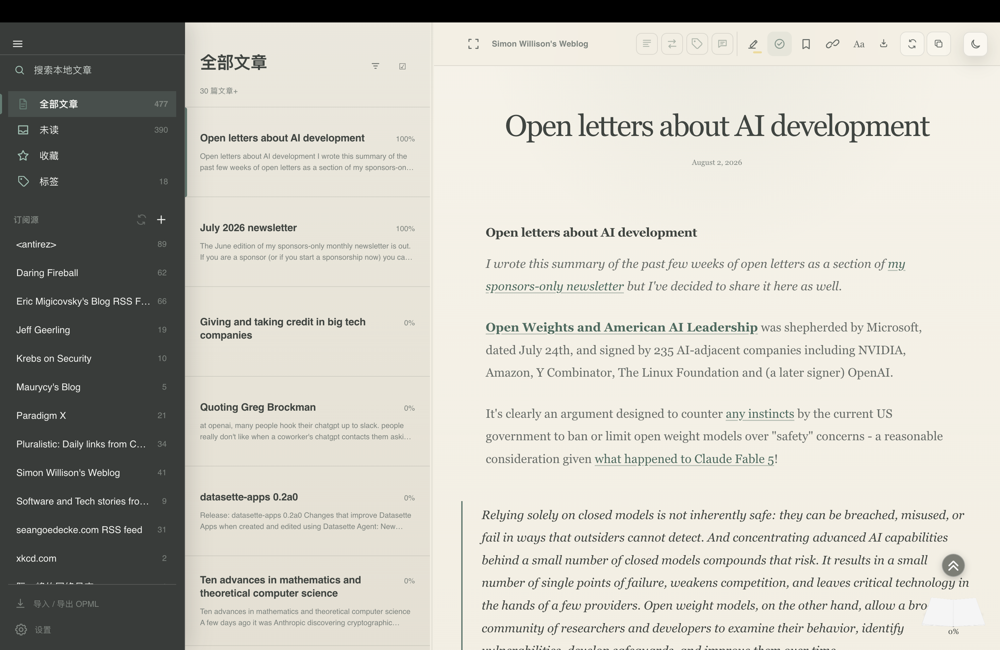
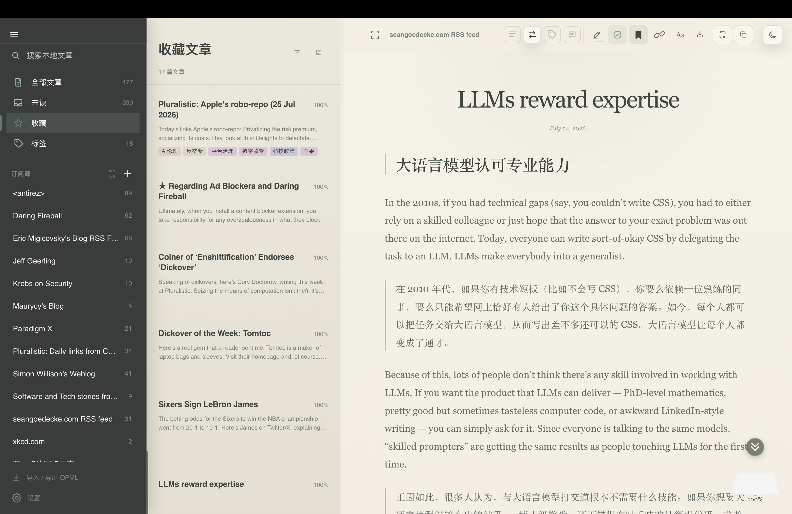
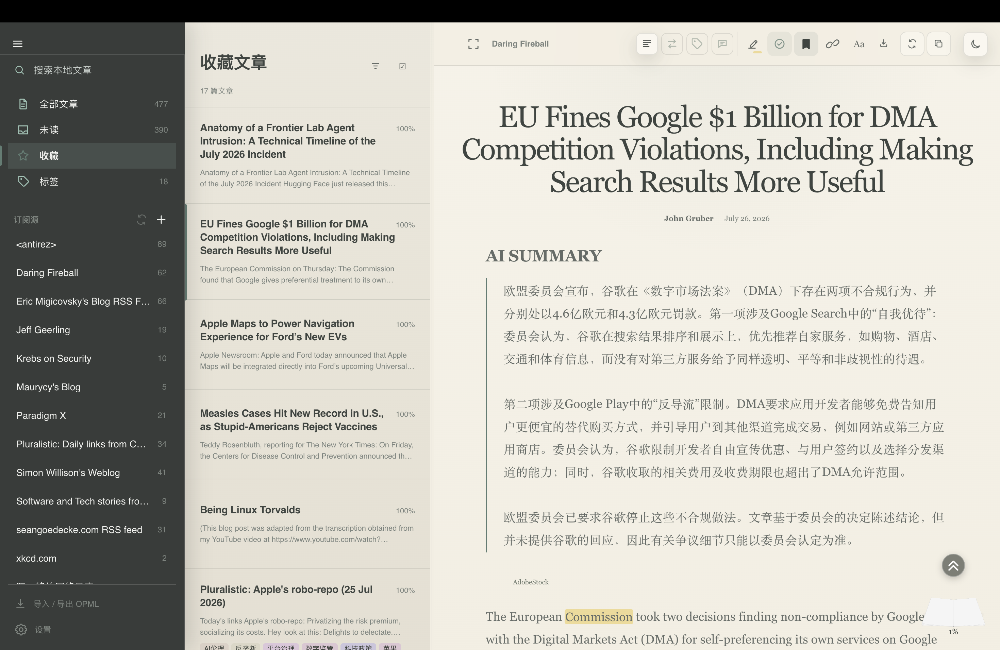
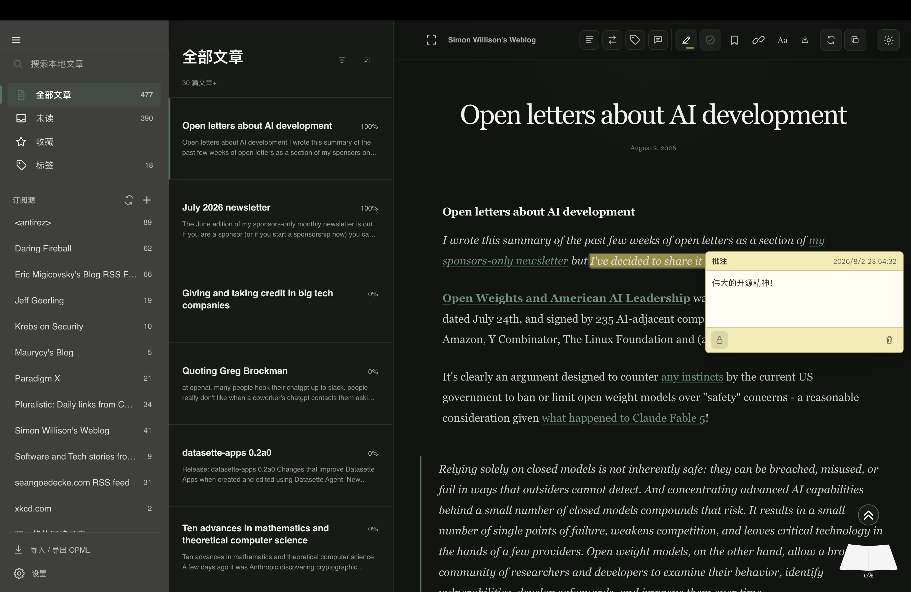
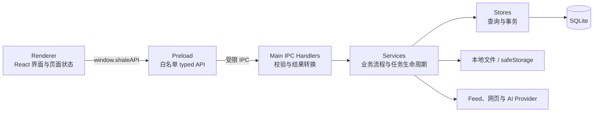

# Shale

> **Let ideas settle into layers.**

Shale 是一款本地优先、面向深度阅读的桌面 Feed 阅读器。它把订阅、正文清洗、
离线保存与可选的 AI 辅助能力放在同一个个人阅读空间中；基础阅读不要求账号，
使用 Summary、Translation、Tag Agent 或 Article Chat 时，则会按功能需要将内容
发送给用户配置的模型服务。

<!-- 人工补充：确认公开发布状态后，再添加 Release、Build Status 和 License 徽章。 -->

## 界面预览

### 基础阅读

白天模式下的订阅源、文章列表与 Reader 三栏阅读界面。



### 双语全文翻译

在 Reader 中按段落对照显示原文与译文。



### AI 摘要

摘要结果直接呈现在正文阅读路径中。



### 黑夜阅读与批注

黑夜模式下的正文阅读、文本高亮与批注卡片。



## 设计理念

### Let ideas settle into layers.

Shale 意为“页岩”。页岩由细小的沉积物在时间中逐层形成，正如阅读：零散的信息
不断流入，经过选择、理解和思考，最终沉淀为属于读者自己的知识结构。

因此，Shale 并不追求让用户消费更多信息，而是希望为信息提供一个可以停留、
被理解并逐渐形成层次的空间。

> **Let ideas settle into layers.**
>
> 让思想沉淀，层层成岩。

### 从岩层走向纸张

Shale 的视觉系统以 **Stone to Paper** 为核心概念。

界面从左到右对应一条完整的阅读路径：

- Feed 区域代表信息的来源与长期积累，如同稳定而深沉的岩层；
- 文章列表是筛选与整理发生的过渡层；
- Reader 则是温暖、安静的纸张，是信息真正进入阅读与思考的地方。

这种从深色岩灰逐渐走向温暖纸色的变化，不只是为了区分栏目，也在视觉上呈现
“来源、筛选、阅读、沉淀”的过程。

矿物绿是贯穿白天与黑夜模式的品牌强调色，用于选中、焦点和少量关键反馈。
其余界面以低饱和的岩灰、暖灰和纸色为主。不同的中性色负责建立层次，而真正的
强调色保持克制，让文章内容始终处于视觉中心。

### 阅读优先

阅读器的界面应当帮助内容退去噪声，而不是成为新的噪声。

Shale 重视清晰的信息层级、适合长时间阅读的对比度和稳定的正文排版。Feed、
文章列表和工具栏承担导航与辅助职责；Reader 才是视觉和操作的最终落点。
必要时，辅助栏目可以收起，让用户回到更纯粹的阅读空间。

“简洁”并不意味着把整个界面压缩为单一颜色，而是让每一种颜色、层级和交互
都具有明确职责，不与正文争夺注意力。

### 克制，但不失去生命力

安静不等于冰冷，克制也不等于毫无个性。

Shale 允许细小的动画、状态反馈和视觉隐喻存在，为阅读空间保留一点灵动感。
它们应当出现在等待、切换、空状态或操作反馈之中，在用户开始阅读后自然退场。
这样的细节不是为了炫技，而是让工具拥有温度，同时不打断注意力。

### AI 是辅助层，而不是阅读的替代品

Shale 使用 AI 降低语言、篇幅和背景知识带来的阅读门槛，但不让模型取代原文和
用户自己的判断。

摘要帮助建立入口，翻译帮助跨越语言，问答帮助寻找上下文；最终被阅读、理解和
保留下来的，仍然是文章本身以及读者形成的认识。用户应当能够决定何时使用 AI，
并保有对 Provider、模型和相关配置的选择权。

Shale 希望 AI 像页岩中的一层辅助矿物：它改善阅读过程，却不覆盖原有内容，也不
喧宾夺主。

## 核心功能

### 1. 订阅管理与同步

- 通过 HTTP(S) URL 添加、编辑和删除订阅，解析 RSS 2.0、Atom 与 JSON Feed，
  并用规范化 Feed URL 和文章身份去重。
- 支持单个订阅或全部订阅的手动同步、同步进度与失败提示、ETag / Last-Modified
  条件请求；应用启动时会同步一次，之后按当前全局固定的 30 分钟周期同步。
- 支持 OPML 2.0 导出，以及嵌套 OPML 的 `merge` / `replace` 导入。导入保存订阅
  元数据，后续同步再获取文章。
- Feed、文章元数据、已读状态和抓取结果保存在本机 SQLite；已成功清洗的正文可在
  重启后直接读取。

### 2. 内容清洗与阅读呈现

- 打开文章时，Shale 可先显示 Feed 内嵌正文或摘要预览，再在后台通过普通 HTTP、
  增强请求和受限的隐藏 Chromium 抓取三级策略获取原网页。
- Main 进程使用 Mozilla Readability 提取正文，经 DOMPurify 清洗并修正相对链接、
  图片与媒体地址，同时生成 Cleaned HTML、Cleaned Markdown 和稳定的翻译分段。
- Reader 使用本地定制样式呈现清洗后的 HTML；用户还可以切换查看原始 Cleaned
  Markdown 文本。Markdown 主要供 AI 和导出使用，并不是另一套富文本 Reader。
- 当前实际存在的阅读呈现是清洗 Reader、原始 Markdown 文本，以及翻译结果的
  Original / Bilingual 切换。课程早期草稿中的内嵌 Web / Dual 模式尚未落地；
  原文和文章内 HTTP(S) 链接会在系统默认浏览器中打开。

### 3. AI 摘要（Summary Agent）

- 对已持久化的完整 Cleaned Markdown 生成简体中文或英文摘要，提供“简短”
  （约 60～100 词）、“适中”（约 150～250 词）和“详细”（约 300～500 词）
  三档提示约束。
- 使用独立的 Summary Provider、Base URL、可编辑模型 ID 和 API Key；输出以流式
  方式显示，完成后保存到 SQLite。
- 摘要按文章内容哈希、语言和长度档位复用缓存。正文变化后旧结果会标为过期，
  由用户显式重新生成；启动时中断的任务会转为可重试失败状态。

### 4. AI 全文翻译（Translation Agent）

- 源语言可自动检测或显式选择；目标语言支持英语、简体中文、香港繁体中文、
  日语、韩语、德语、法语和西班牙语。翻译按 Reader 语义块生成并与原文对齐，
  图片、表格、代码和公式等非翻译结构保留原位。
- “标准翻译”会渐进显示已验证并持久化的段落，优先处理视口附近内容；可以暂停
  并继续未完成段落，也能复用兼容缓存或从失败结果继续。“深度翻译（实验性）”
  依次执行初译、专业审校和重写，会增加请求、Token 与等待时间，当前运行中不能暂停。
- 可选智能全文上下文；超过 48,000 字符时按固定预算从文章开头、中部和结尾做
  确定性代表采样，分析失败会带警告降级到普通翻译。
- 随应用离线提供 29 个翻译专家和 34 个术语库；也可预览、导入和移除受限 YAML
  用户专家及 UTF-8 CSV 用户术语库。资源的启用状态会参与翻译缓存身份。
- 支持单词、短语和句子的结构化划词翻译、上下文义项、例句及源语言发音信息；
  新请求、选区变化或界面关闭会取消旧的划词请求。
- 全文与划词翻译共用独立的 Translation Provider 路由。高级翻译的契约与待完成人工
  验收见 [`docs/ai/translation-advanced.md`](docs/ai/translation-advanced.md) 和
  [`docs/ai/translation-advanced-verification.md`](docs/ai/translation-advanced-verification.md)。

## 辅助功能

以下顺序保留课程草稿与要求中的辅助功能分类，并标明当前实现边界。

1. **多语言支持** Summary 支持简体中文和英文，Translation 支持
   上述八种目标语言。
2. **结构化日志与诊断、调试工具** Main 进程写入带轮转和保留上限的
   本地 JSONL 结构化日志；用户可从 Settings 导出最近最多 1,000 条经过二次白名单
   清洗的诊断记录。导出由用户显式保存，不会自动上传。开发者还可参考
   [`docs/debugging-cdp.md`](docs/debugging-cdp.md) 使用 CDP 调试 Renderer。
3. **大模型用量统计** Settings 提供 7 / 30 / 90 天的请求与 Token 趋势，
   并按日期、功能、Provider 配置和模型汇总 Summary、Translation 与 Article Chat
   请求。Token 只累计 Provider 明确报告的字段，不把缺失值估算为零。
4. **笔记、文摘与内容导出** Reader 可用四种颜色创建本地文本高亮并
   添加、锁定或删除批注笔记；支持单篇和多选文章导出 Markdown，并按文章选择是否
   包含摘要、当前有效翻译和笔记。导出会保留高亮，远程图片会尽力下载到同目录的
   `.assets` 资源目录；下载失败时保留原 URL。
5. **标签系统** 可手动创建标签、为文章添加或移除标签、查看标签及
   文章数，并按标签浏览或使用搜索语法筛选；Tag Agent 会基于最多前 2,000 个
   Cleaned Markdown 字符，从既有标签和新标签中提出候选，确认后写入。尚有优化空间，但是基本闭环与搜索联动已实现。
6. **已读状态管理** 已读 / 未读、阅读进度和收藏状态均保存在本地，
   文章列表支持未读与收藏筛选，并可从阅读进度控件返回先前位置。
7. **搜索** 在本地文章标题、正文、作者和 Feed 范围内搜索，支持短查询
   回退、引号短语、当前 / 全部订阅范围，以及 `tag`、`feed`、`title`、`content`、
   `author`、`starred`、`read` 的包含、必须和排除过滤语法。
8. **AI Provider 与模型配置** 一个活动配置可分别为 Summary、
   Translation、Tag 和 Article Chat 选择 Provider、Base URL、模型与 API Key。
   内置 OpenAI、Anthropic、DeepSeek、Gemini、OpenRouter 和自定义
   OpenAI-compatible 预设，模型 ID 保持可编辑；未配置 AI 时，订阅、同步、清洗、
   阅读、搜索、批注和导出仍可使用。

### 其他已实现的辅助能力

- **Article Chat：** 围绕当前文章进行持久化多轮问答，支持流式回答、停止、失败重试、
  编辑问题后重发、重新生成答案，以及从原文或双语 Reader 选区发问。可附加文本、
  Markdown、CSV、JSON、HTML、PDF、PNG、JPEG 和 WebP，或粘贴剪贴板图片；不提供
  Web 搜索、OCR、Office 文档或多文章问答。详细范围见
  [`docs/ai/article-chat.md`](docs/ai/article-chat.md)。
- **桌面阅读体验：** 白天 / 黑夜主题、可折叠与可调宽的三栏布局、阅读进度与可选
  翻页动画，以及对当前文章的本地收藏。

## 技术架构

### 技术栈

| 层级 | 技术 | 当前职责 |
| --- | --- | --- |
| 桌面运行时 | Electron 43 | 窗口、生命周期、文件对话框、安全存储和系统浏览器调用 |
| Renderer | React 19、TypeScript 5.9、CSS | 页面、交互、Reader 和任务状态投影 |
| Preload / IPC | `contextBridge`、共享 TypeScript 契约 | 暴露按领域命名的最小 `window.shaleAPI` |
| 构建与打包 | Vite 5、Electron Forge 7 | Main、Preload、Renderer 构建及平台原生产物 |
| 本地存储 | SQLite、`better-sqlite3` | 迁移、Feed、正文、AI 结果、批注、标签、用量和 Chat |
| 内容处理 | `rss-parser`、JSDOM、Readability、DOMPurify、Turndown | Feed 解析、网页提取、HTML 清洗、Markdown 与分段生成 |
| AI 适配 | 自建流式 HTTP 适配器、OpenCC、YAML、PDF.js | 多 Provider 协议、翻译规范化、专家/术语和附件文本提取 |
| 测试 | Vitest 4（通过 Electron Node 模式运行） | 单元、Store / Service 集成、迁移与契约验证 |

### 分层结构



- **Renderer** 不直接导入 Node.js、Electron、文件系统或数据库，只处理呈现和用户
  交互。持续任务通过带身份的事件更新界面，组件卸载时移除监听器。
- **Preload** 只向 `window.shaleAPI` 暴露 Feed、Content、Provider、Summary、
  Translation、Usage、Tag、Annotation、Export、Chat、Diagnostics 和 External 等
  typed API，不暴露原始 `ipcRenderer`。
- **Main IPC Handler** 验证发送者来自主窗口主 frame，并检查请求形状；它负责调用
  Service 和把异常转换为稳定错误，不承载主要业务流程。
- **Service** 负责同步、内容流水线、AI 任务、导出和取消 / 恢复等流程；**Store**
  封装 SQLite 查询和事务。数据库在 Main 启动时执行前向迁移，启用 WAL 与外键。

### 核心数据流

1. **Feed 同步：** URL / OPML → Main 获取并解析 RSS、Atom 或 JSON Feed → 规范化和
   去重 → FeedStore / EntryStore → Renderer 接收列表及进度。
2. **正文清洗：** 打开文章 → 读取本地正文或构造 Feed 预览 → 多级网页抓取 →
   Readability → DOMPurify → Cleaned HTML、Markdown 与 segments → ContentStore → Reader。
3. **AI 请求：** Renderer 发送文章身份和选项 → Main 读取已清洗内容、Provider 配置
   与密钥 → ProviderRegistry 选择 OpenAI-compatible、Anthropic 或 Gemini 协议 →
   流式结果经校验后写入 Store，并发送带 `runId` 的事件；用量记录独立结算。
4. **本地恢复：** 启动时迁移 SQLite，并把遗留的运行中 Summary、Translation、
   Usage 与 Article Chat 任务协调为可解释的中断 / 重试状态；兼容的完成结果直接复用。

### 安全与数据边界

- 主窗口启用 `contextIsolation`，关闭 `nodeIntegration`；窗口自身拒绝外部导航与新窗口。
  Reader 链接在 Main 再次校验后，只允许 HTTP(S) URL 交给系统浏览器。
- 网页正文和 Provider 返回的翻译 HTML 都视为不可信输入。正文经过 DOMPurify；翻译
  还会校验元素结构、目标语言并恢复受控属性后才持久化和呈现。
- API Key 不进入 SQLite，也不会由 Preload 返回。Main 将密钥保存在 Electron
  `userData` 下独立的 `ai-secrets.json`，文件权限设为 `0600`；操作系统安全存储可用时
  用 `safeStorage` 加密。Linux 若只提供 `basic_text` 等弱后端，会使用明确标记为
  `insecure` 的本地明文降级，并在设置界面提示风险。
- Feed、正文、阅读状态、摘要、翻译、批注、标签、用量和 Chat 历史默认保存在本机。
  结构化日志位于 Electron 日志目录；Chat 图片附件位于 `userData` 下的受控附件目录；
  部分界面偏好保存在 Renderer 的本地存储。
- 调用外部 AI 时，相关功能会向所选 Provider 发送完成任务所需的文章内容或片段，
  以及用户问题、选区、专家 / 术语上下文或所选附件内容。Shale 当前没有项目自建的
  账号、云同步或遥测上传服务，但这不意味着第三方 Provider 请求留在本机。

## 快速开始

### 环境要求

- Node.js `24.11.1`（仓库 `.nvmrc`；项目约定使用 Node.js 24.x LTS）；
- npm 与仓库唯一锁文件 `package-lock.json`；
- `better-sqlite3` 是原生依赖。`npm ci` 会按当前 Electron ABI 自动重建并验证；
  若没有可用预编译包，需要目标平台的原生编译工具链。

### 安装依赖

```bash
npm ci
```

### 启动开发环境

```bash
npm start
```

### 构建与打包

```bash
# 生成当前操作系统 / 架构的未安装应用目录
npm run package

# 生成 Forge 为当前平台配置的安装包或归档
npm run make
```

产物写入 `out/`。Forge 默认不能用一个平台的本机构建证明另一平台的原生模块可用。

## 配置

### AI Provider

在 **Settings → 模型服务** 中分别配置 Summary、Translation、Tag 和 Article Chat：

1. 选择预设 Provider 或自定义 OpenAI-compatible；
2. 检查或修改 Base URL 与模型 ID；
3. 输入对应 API Key，并按需运行连接测试；
4. 若 Chat 模型支持图片，显式开启图片能力；程序不会仅凭模型名推断该能力。

Provider 配置可保存到本地，密钥不会回显。真实服务的模型名称、协议兼容性、计费
和内容处理政策由对应 Provider 决定；仓库自动化测试默认使用 Mock / fake Provider，
不会消耗真实 Key。

### 本地数据

应用通过 Electron 的平台目录定位数据，不在 README 写死绝对路径：

- `userData/shale.db`：SQLite 主数据库和前向迁移记录；
- `userData/ai-secrets.json`：独立密钥文件；
- `userData/chat-attachments/`：受控的 Chat 图片附件；
- Electron `logs/structured/`：带轮转的结构化日志；
- 用户显式选择的位置：OPML、Markdown 和诊断导出文件。

## 开发与验证

```bash
npm run typecheck
npm run lint
npm test
npm run verify:native
```

不要直接运行裸 `vitest`：项目测试通过 Electron 的 Node 模式执行，以保持
`better-sqlite3` 的 Electron ABI。GitHub Actions 还会在 Ubuntu、Windows 和 macOS
原生 runner 上执行检查并构建对应产物。

README-only 修改不需要运行完整应用测试。功能特有的真实 Provider、GUI、打包与平台
验收记录位于相关 `docs/` 文档和 Issue 中。

## 平台支持与验证状态

| 平台 | 工程 / CI 目标 | 仓库能够证明的状态 |
| --- | --- | --- |
| Windows 11 x64 | Squirrel | CI 已配置；专项文档记录了 Windows x64 打包、启动进程和 Article Chat 包内容自动检查。最终 GUI 与真实 Provider 人工验收仍未完成。 |
| Linux x64 | Debian、RPM、Arch Linux | CI 已配置；Main 会在 Wayland 环境启用原生 Ozone / Wayland 参数。原生 Wayland 的最终 GUI、真实 Provider 和打包冒烟仍需人工执行。 |
| macOS arm64 | ZIP | CI 已配置，并检查 arm64 可执行文件、原生 SQLite 模块和 ad-hoc 签名；仓库未记录本轮完整人工 GUI 验收。 |

这里的“CI 已配置”表示工作流存在相应 job，不等同于当前提交的远端 job 已通过；
“可构建”也不等同于所有交互已经人工验证。

## 项目状态

Shale 当前处于**课程项目的功能完成与人工验收阶段**。仓库已经形成“订阅 → 同步 →
清洗 → 本地阅读 → 可选 AI 辅助 → 批注 / 标签 / 导出”的自动化可验证链路，并加入
Advanced Translation 与 Article Chat；这些功能的最终 Windows、原生 Wayland、真实
Provider 和主观质量验收仍由人工完成。

<!-- 人工补充：确认当前版本是否已公开发布，以及是否适合面向普通用户日常使用。 -->

## 已知限制

- 课程早期设计中的内嵌 Web / Dual 阅读模式尚未实现；当前原文在系统浏览器打开。
- Reader 正文已本地持久化，但远程图片、视频等媒体仍可能依赖网络；离线不保证媒体完整。
- Feed 记录虽然有每订阅源 `syncIntervalMin`，当前调度器仍使用全局固定 30 分钟周期，
  尚未按每个订阅源的值分别调度。
- 页面正文提取依赖站点结构、网络和反自动化策略，不能保证所有网站都能成功清洗；
  失败时会保留 Feed 预览、已有缓存或打开原文的路径。
- 应用界面尚无完整本地化；内置分享流程以及标签的全局重命名 / 删除尚未实现。
- Summary、Translation、Tag Agent 与 Article Chat 的真实效果、费用和数据处理取决于
  用户选择的 Provider。最终跨平台 GUI、真实 Provider、翻译质量与系统密钥行为仍有
  未完成的人工验收项。
- Linux 缺少可用系统安全存储后端时，API Key 会在明确警告后以本地明文文件降级保存。

完整问题与开发记录请参阅
[GitHub Issues](https://github.com/qytlix/readability-multiplatform/issues)、
[`PLAN.md`](PLAN.md) 和相关验证文档。

## 项目结构

```text
readability-multiplatform/
├── src/
│   ├── main/                 # Electron Main、领域 Service / Store、IPC 与迁移
│   │   ├── ai/               # Provider、Summary、Translation、Usage、Article Chat
│   │   ├── feed/             # Feed、同步、网页抓取与内容清洗
│   │   ├── annotations/      # 批注业务与持久化
│   │   ├── export/           # Markdown / 文摘导出
│   │   ├── tags/             # 手动标签与 Tag Agent
│   │   ├── database/         # SQLite 连接与迁移执行器
│   │   └── migrations/       # 前向 Schema 迁移
│   ├── preload/              # contextBridge 与受限 window.shaleAPI
│   ├── renderer/             # React UI、Reader、设置和交互状态
│   └── shared/               # 跨进程契约、类型与稳定错误
├── resources/                # 离线专家与术语数据库资源
├── tests/                    # fixtures、unit 与 integration 测试
├── scripts/                  # 原生模块、测试运行器和资源构建脚本
├── docs/                     # 设计、ADR、验证与调试记录
├── assets/                   # 应用图标等打包资源
├── .github/workflows/        # 多平台 CI 与 draft release 工作流
├── forge.config.ts           # Electron Forge 打包配置
└── package.json              # npm 脚本和依赖入口
```

## 贡献

欢迎通过 Issue 报告问题或提出建议。提交代码前，请：

1. 创建或关联对应 Issue；
2. 从最新主分支创建独立分支；
3. 保持修改范围清晰；
4. 运行相关检查与测试；
5. 在 Pull Request 中说明变更、验证结果和已知限制。

## 团队分工

### 秦一天（[GitHub](https://github.com/qytlix)）

- SQLite 数据模型、迁移和持久化体系
- Feed 添加、解析、同步与正文持久化
- 网页正文抓取、提取与内容清洗
- OPML 导入与导出
- Markdown 内容导出
- 文章收藏与搜索
- 手动标签、标签筛选与 Tag Agent
- 开发文档、Release 工作流与 Git Tag 维护

### 陈彦杰（[GitHub](https://github.com/tkg2197)）

- AI Provider、模型调用及相关基础设施
- AI Summary 基本功能
- AI Translation 基本功能
- 翻译术语库与 AI 翻译专家
- Article Chat
- 文本高亮、批注与笔记
- 正文抓取结果的结构与格式优化
- 界面视觉实现与样式优化
- 交互细节和其他辅助功能

### 陈一诺（组长）（[GitHub](https://github.com/chaocyndrome)）

- 需求拆解、进度规划、任务分配、风险管理与交付验收
- 应用工程框架、依赖和基础 IPC 搭建
- 早期 UI 框架、Stone to Paper 视觉体系与主题设计
- Reader 阅读呈现与桌面阅读体验
- 交互逻辑设计、验收和针对性优化
- 结构化日志、诊断导出与跨模块可观测性
- AI 用量统计
- 重新翻译、深度翻译及翻译质量优化
- 项目文档、Release 协调与跨平台交付维护

## 致谢

感谢课程指导教师 [李骏（neolee）](https://github.com/neolee) 的指导。

Shale 的早期构思参考了 [Mercury](https://github.com/neolee/mercury)。

<!--
人工补充：package.json 当前声明 MIT，但仓库没有 LICENSE 文件。确认许可证并添加
LICENSE 后，再在此加入正式 License 章节和链接。
-->
