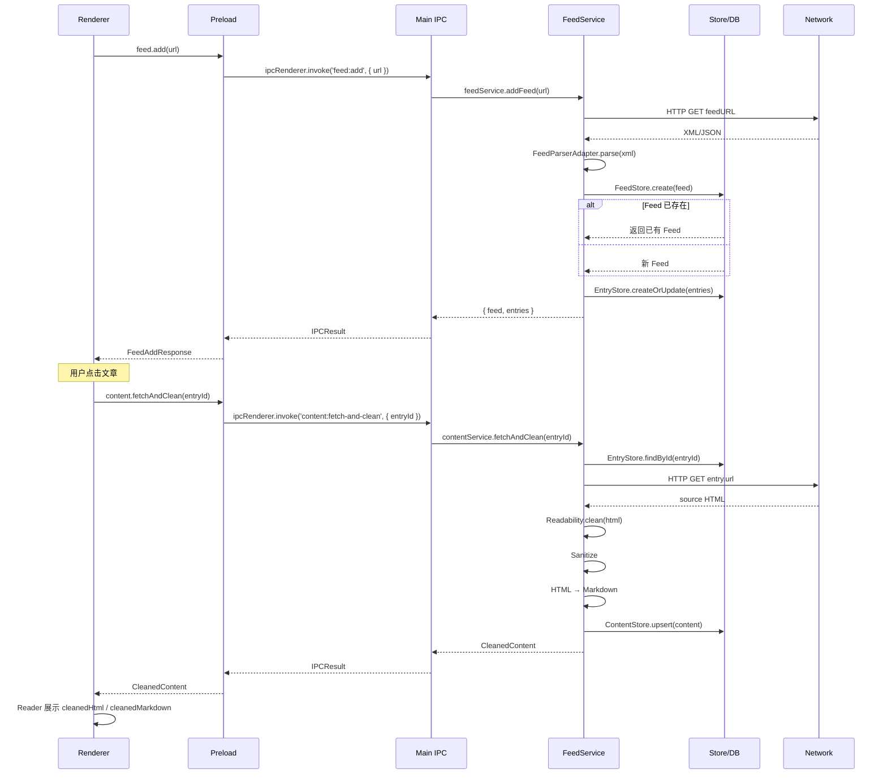

# Feed / 内容管线模块规划

> 负责人：qyt（本文件的编写者）
> 状态：M0 — 规划阶段
> 最后更新：2026-07-14

---

## 目录

1. [模块范围](#1-模块范围)
2. [目录结构](#2-目录结构)
3. [数据模型与 Schema](#3-数据模型与-schema)
4. [Store 层](#4-store-层)
5. [Service 层](#5-service-层)
6. [IPC 层](#6-ipc-层)
7. [Preload API](#7-preload-api)
8. [Renderer 页面](#8-renderer-页面)
9. [错误处理](#9-错误处理)
10. [Issue 拆分](#10-issue-拆分)
11. [测试策略](#11-测试策略)
12. [风险与依赖](#12-风险与依赖)
13. [契约 Review 清单](#13-契约-review-清单)

---

## 1. 模块范围

### 范围内

| 功能 | P0/P1 | 说明 |
|---|---|---|
| Feed 添加、删除、修改 | P0 | 支持输入 URL 添加订阅源 |
| RSS 2.0 解析 | P0 | 基础字段同步，优先 `<guid>` 去重 |
| Atom 解析 | P0 | 使用 `atom:id` 去重 |
| JSON Feed 解析 | P0 | 使用 `id` 去重 |
| 手动 Sync | P0 | 单 Feed 和全量同步 |
| 定时 Sync | P0 | 最小可靠版本，默认间隔可配置 |
| 去重 | P0 | `(feedId, guid)` 和 `(feedId, url)` 双唯一约束 |
| Entry 文章列表查询 | P0 | keyset 分页、按 Feed/已读筛选 |
| OPML 导入 | P0 | 嵌套 outline、merge/replace 两种模式 |
| OPML 导出 | P0 | 导出当前所有 Feed |
| 单篇网页获取 | P0 | 基础 HTTP fetch |
| 正文提取与清洗 | P0 | Mozilla Readability |
| Cleaned HTML 生成 | P0 | 清洗后 HTML，经过 sanitize |
| Cleaned Markdown 生成 | P0 | 由 Cleaned HTML 转换 |
| 清洗失败原文/Web 回退 | P0 | 失败时保留原文访问路径 |
| 同步状态与错误提示 | P0 | 用户可感知的进度和错误 |
| 搜索（标题+摘要） | P1 | 300ms debounce |
| 完整 Feed 管理 UI | P0 | 列表、编辑、删除 |

### 范围外（不属于本模块）

- Reader 展示和阅读状态（Reader 负责人）
- AI Summary / Translation（AI 负责人）
- 密钥和 Provider 配置（AI 负责人）
- 用户全局设置（组长）

### 模块边界

本模块是 **Cleaned Content 契约的生产者**。产出物为：

- 清洗后的 HTML
- 清洗后的 Markdown
- 可选的 segment ID、顺序和文本（供 Translation 对齐使用）

Reader 和 AI 模块只依赖本模块输出的契约，不依赖本模块的内部实现。

---

## 2. 目录结构

```text
src/
  main/
    feed/
      FeedStore.ts          # feed 表的 CRUD
      EntryStore.ts          # entry 表的 CRUD 和查询
      ContentStore.ts        # content 表的 CRUD
      FeedService.ts         # Feed 业务流程（同步、解析、去重）
      ContentService.ts      # 正文获取、清洗、转换
      FeedParserAdapter.ts   # 解析器封装（RSS/Atom/JSON Feed）
      ContentFetcher.ts      # HTTP 网页获取
      ContentCleaner.ts      # Readability + 清洗
      MarkdownConverter.ts   # HTML → Markdown 转换
    migrations/
      001_create_feeds.sql
      002_create_entries.sql
      003_create_contents.sql
    ipc/
      feed.handler.ts        # feed:* 领域 IPC handler
  preload/
    feed.api.ts              # 暴露给 renderer 的 feed 领域 API
  renderer/
    features/
      feeds/
        FeedList.tsx          # Feed 列表侧栏
        FeedAddDialog.tsx     # 添加 Feed 对话框
        FeedEditDialog.tsx    # 编辑 Feed 对话框
        FeedSyncStatus.tsx    # 同步状态提示
        EntryList.tsx         # 文章列表
        EntryListItem.tsx     # 文章列表项（轻量视图）
        EntryDetail.tsx       # 文章详情（HTML/Markdown 展示）
  shared/
    contracts/
      feed.types.ts           # Feed 领域共享类型
      content.types.ts        # Cleaned Content 契约类型
      feed.ipc.ts             # feed:* IPC 通道和类型
    errors/
      feed.errors.ts          # Feed 模块错误码和结构
    events/
      feed.events.ts          # Feed 模块事件类型

tests/
  fixtures/
    feeds/
      rss2-sample.xml         # RSS 2.0 fixture
      atom-sample.xml         # Atom fixture
      jsonfeed-sample.json    # JSON Feed fixture
      edge-cases/             # 边缘用例集合
        empty.rss.xml
        missing-fields.rss.xml
        duplicate-guids.rss.xml
        cdata-chinese.rss.xml
        redirect.rss.xml
        timeout.rss.xml
    articles/
      simple-article.html     # 普通文章
      complex-article.html    # 含表格/代码/图片
      malformed-article.html  # 破损 HTML
      chinese-article.html    # 中文文章
  databases/
    feed-fixture.ts           # 内存数据库 fixture 构建函数
  integration/
    feed-store.test.ts
    feed-service.test.ts
    feed-parser.test.ts
    feed-ipc.test.ts
```

---

## 3. 数据模型与 Schema

### 3.1 `feed` — 订阅源

参考 `database-schema.md` 中已有定义，字段保持一致：

```sql
CREATE TABLE IF NOT EXISTS feed (
    id               INTEGER PRIMARY KEY AUTOINCREMENT,
    title            TEXT,
    feedURL          TEXT NOT NULL UNIQUE,
    siteURL          TEXT,
    feedParserVersion INTEGER,          -- 解析器版本，用于内容刷新检测
    lastFetchedAt    TEXT,              -- ISO-8601 datetime
    lastSyncStatus   TEXT DEFAULT 'never',  -- never | success | error
    lastSyncError    TEXT,              -- 最近一次同步错误消息
    syncIntervalMin  INTEGER DEFAULT 30,   -- 定时同步间隔（分钟）
    createdAt        TEXT NOT NULL       -- ISO-8601 datetime
);

CREATE INDEX idx_feed_feedURL ON feed(feedURL);
```

**关键约定**：
- `feedURL` 全局唯一，作为去重语义
- `lastSyncStatus` 用于 UI 展示同步状态
- 远端 metadata 更新时不覆盖本地用户修改的 `title`

### 3.2 `entry` — 文章条目

```sql
CREATE TABLE IF NOT EXISTS entry (
    id            INTEGER PRIMARY KEY AUTOINCREMENT,
    feedId        INTEGER NOT NULL REFERENCES feed(id) ON DELETE CASCADE,
    guid          TEXT,                    -- 来自 feed 的全局唯一 ID
    url           TEXT,                    -- 文章 URL
    title         TEXT,
    author        TEXT,
    publishedAt   TEXT,                    -- ISO-8601 datetime
    summary       TEXT,                    -- Feed 提供的摘要
    isRead        INTEGER NOT NULL DEFAULT 0,   -- 0=false, 1=true
    isStarred     INTEGER NOT NULL DEFAULT 0,
    isDeleted     INTEGER NOT NULL DEFAULT 0,   -- 软删除标记（tombstone）
    contentHash   TEXT,                    -- 内容哈希，用于检测内容变化
    createdAt     TEXT NOT NULL,
    updatedAt     TEXT NOT NULL,

    UNIQUE(feedId, guid),
    UNIQUE(feedId, url)
);

CREATE INDEX idx_entry_feedId ON entry(feedId);
CREATE INDEX idx_entry_guid ON entry(guid);
CREATE INDEX idx_entry_url ON entry(url);
CREATE INDEX idx_entry_publishedAt ON entry(publishedAt DESC);
CREATE INDEX idx_entry_feed_published ON entry(feedId, publishedAt DESC);
CREATE INDEX idx_entry_isRead ON entry(isRead);
CREATE INDEX idx_entry_isStarred ON entry(isStarred) WHERE isStarred = 1;
```

**关键约定**：
- 去重策略：RSS 优先用 `<guid>` → 回退 `url`；Atom 用 `atom:id`；JSON Feed 用 `id`
- `isDeleted` 是 tombstone 标记，已软删除的 entry 绝不因同步复活
- 远端 metadata 更新时不覆盖 `isRead`、`isStarred` 本地状态
- `contentHash` 用于避免重复清洗或检测内容变化

### 3.3 `entry_content` — 清洗后正文

```sql
CREATE TABLE IF NOT EXISTS entry_content (
    id                  INTEGER PRIMARY KEY AUTOINCREMENT,
    entryId             INTEGER NOT NULL UNIQUE REFERENCES entry(id) ON DELETE CASCADE,
    sourceHtml          TEXT,               -- 从原文 URL 获取的原始 HTML
    sourceUrl           TEXT,               -- 实际获取的 URL（含重定向后）
    cleanedHtml         TEXT,               -- Readability 清洗后的 HTML
    cleanedMarkdown     TEXT,               -- 由 cleanedHtml 转换的 Markdown
    readabilityTitle    TEXT,               -- Readability 提取的标题
    readabilityByline   TEXT,               -- Readability 提取的作者
    readabilityVersion  INTEGER DEFAULT 0, -- 清洗器版本
    markdownVersion     INTEGER DEFAULT 0, -- Markdown 转换器版本
    documentBaseURL     TEXT,               -- 文档基准 URL（解析相对路径用）
    pipelineStatus      TEXT NOT NULL DEFAULT 'pending',
                    -- pending | fetching | cleaning | converting | success | failed
    pipelineError       TEXT,               -- 清洗流水线错误信息
    segmenterVersion    TEXT,               -- Segment ID 生成算法版本
    sourceContentHash   TEXT,               -- 源内容哈希，用于 Translation 缓存失效
    segmentsJson        TEXT,               -- 已持久化的稳定 Reader segment 契约
    createdAt           TEXT NOT NULL,
    updatedAt           TEXT NOT NULL
);

CREATE INDEX idx_entry_content_entryId ON entry_content(entryId);
```

**关键约定**：
- `pipelineStatus` 跟踪清洗流水线的每一步，支持断点恢复
- 版本号字段支持按层重建缓存（参考 IMPLEMENTATION_PLAN.md M4 版本化缓存）
- `sourceContentHash` 是稳定 Reader segments 的 SHA-256，和 `segmenterVersion` 一起用于 AI 翻译缓存失效

### 3.4 Cleaned Content 契约类型（`src/shared/contracts/content.types.ts`）

```typescript
/** 清洗流水线状态 */
export type PipelineStatus =
  | 'pending'
  | 'fetching'
  | 'cleaning'
  | 'converting'
  | 'success'
  | 'failed';

export type ContentSegmentType = 'p' | 'ul' | 'ol';

export interface ContentSegment {
  id: string;
  orderIndex: number;
  type: ContentSegmentType;
  sourceHtml: string;
  sourceText: string;
}

/** 清洗结果（Renderer 和 AI 可安全消费的契约） */
export interface CleanedContent {
  entryId: number;
  sourceUrl: string;
  cleanedHtml: string;
  markdown: string;
  readabilityTitle?: string;
  readabilityByline?: string;
  pipelineStatus: PipelineStatus;
  pipelineError?: string;
  segmenterVersion?: string;
  sourceContentHash?: string;
  segments?: ContentSegment[];
}

/** 文章列表轻量投影（非持久化模型） */
export interface EntryListItem {
  id: number;
  feedId: number;
  feedTitle?: string;
  title?: string;
  author?: string;
  publishedAt?: string;
  createdAt: string;
  isRead: boolean;
  isStarred: boolean;
  summary?: string;
  pipelineStatus: PipelineStatus;
}
```

---

## 4. Store 层

### 职责

- 封装 SQL 查询，不包含业务逻辑
- 返回纯数据（DTO），不操作清洗、解析或网络
- 使用迁移提供的 schema，不在运行时 alter table

### FeedStore

| 方法 | 说明 |
|---|---|
| `create(params)` | 创建 Feed，返回 feed 记录 |
| `findById(id)` | 按 ID 查找 |
| `findByUrl(url)` | 按 feedURL 查找（去重用） |
| `findAll()` | 返回所有 active Feed |
| `update(id, params)` | 更新 metadata（保留 title?） |
| `delete(id)` | 硬删除/级联删除 |
| `updateSyncStatus(id, status, error?)` | 更新同步状态字段 |

### EntryStore

| 方法 | 说明 |
|---|---|
| `createOrUpdate(entry)` | 按 `(feedId, guid)` 或 `(feedId, url)` upsert |
| `findById(id)` | 按 ID 查找 |
| `findByFeed(feedId, options)` | 按 Feed 分页查询 |
| `findAll(options)` | 全量查询（筛选、分页） |
| `markRead(ids, isRead)` | 批量标记已读 |
| `markStarred(id, isStarred)` | 星标切换 |
| `softDelete(id)` | 软删除（tombstone） |
| `countUnread(feedId?)` | 未读数统计 |

**查询参数选项（EntryQuery）**：

```typescript
interface EntryQuery {
  feedId?: number;
  isRead?: boolean;
  isStarred?: boolean;
  search?: string;           // title + summary LIKE
  limit: number;             // 默认 50
  cursor?: {                 // keyset pagination
    publishedAt: string;
    id: number;
  };
}
```

### ContentStore

| 方法 | 说明 |
|---|---|
| `findByEntry(entryId)` | 按 entry 查找 content |
| `upsert(content)` | 创建或更新 content |
| `updatePipelineStatus(entryId, status, error?)` | 更新流水线状态 |
| `deleteByEntry(entryId)` | 删除（级联已由外键处理） |

### 配置 Store（共用）

定时 Sync 间隔等配置项可放到公共 SettingStore 中，本模块依赖即可。

---

## 5. Service 层

### 5.1 FeedService

核心业务流程：

```
addFeed(url)
  → 1. HTTP 获取 feed 内容
  → 2. FeedParserAdapter 解析
  → 3. FeedStore.create() 或已存在返回
  → 4. syncFeed(feed) 立即拉取最新文章
  → 5. 返回 Feed 和初始 Entry 列表

syncFeed(feedId)
  → 1. 从数据库读取 Feed
  → 2. HTTP GET（带上 ETag/Last-Modified）
  → 3. 304 → 无需更新，直接返回
  → 4. 解析
  → 5. 对比现有 Entry，upsert 新数据
  → 6. 更新 Feed.lastFetchedAt 和 sync status

syncAll()
  → 依次/并发 syncFeed(feedId) 每个 active Feed
  → 默认并发上限 6，可配置

removeFeed(feedId)
  → 软删除/硬删除（根据设计）Feed 及级联 Entry/Content
```

### 5.2 ContentService

```
fetchAndClean(entryId)
  → 1. 读取 entry.url
  → 2. ContentFetcher.fetch(url) → sourceHtml
  → 3. ContentCleaner.clean(sourceHtml, baseUrl) → cleanedHtml
  → 4. MarkdownConverter.convert(cleanedHtml) → cleanedMarkdown
  → 5. 写入 entry_content（状态：success）
  → 6. 发出 content:ready 事件
  → 7. 返回 CleanedContent

on failure:
  → 写入 entry_content（状态：failed，记录 pipelineError）
  → 发出 content:error 事件
```

### 5.3 FeedParserAdapter

封装第三方解析库的接口：

```typescript
interface ParsedFeed {
  title: string;
  siteUrl?: string;
  feedUrl: string;
  entries: ParsedEntry[];
}

interface ParsedEntry {
  guid: string;
  url?: string;
  title?: string;
  author?: string;
  publishedAt?: string;   // ISO-8601 或 null
  summary?: string;
  contentHtml?: string;    // Feed 内嵌的 HTML 内容
}

interface FeedParserAdapter {
  parse(xml: string, sourceUrl: string): ParsedFeed;
}
```

### 5.4 ContentFetcher

```typescript
interface FetchResult {
  url: string;             // 最终 URL（重定向后）
  statusCode: number;
  headers: Record<string, string>;
  body: string;
  charset?: string;
}

interface ContentFetcher {
  fetch(url: string, signal?: AbortSignal): Promise<FetchResult>;
}
```

- 使用统一的 `HttpClient`（参考 IPC-flow.md 架构的共用网络层）
- 支持 timeout、AbortSignal
- 限制响应体大小（如 10MB）
- 正确解析 charset（Content-Type header + HTML meta）
- 验证 HTTP status（仅 2xx 视为成功）

### 5.5 ContentCleaner

```typescript
interface ContentCleaner {
  clean(html: string, baseUrl: string): CleanResult;
}

interface CleanResult {
  title: string;
  byline?: string;
  content: string;          // cleaned HTML
  documentBaseURL: string;
}
```

- 使用 Mozilla Readability 库
- 输出再次经过 DOMPurify / sanitize
- 提取 title 和 byline 供上层使用

### 5.6 MarkdownConverter

```typescript
interface MarkdownConverter {
  convert(html: string): string;
}
```

- 使用 turndown 或类似 GFM 兼容的 HTML → Markdown 转换库
- 输出用于 AI 输入和 Reader 展示

---

## 6. IPC 层

### 通道命名

按 `feed:*`、`content:*` 领域命名：

| 通道 | 方向 | 说明 |
|---|---|---|
| `feed:add` | invoke | 添加 Feed URL |
| `feed:list` | invoke | 获取所有 Feed |
| `feed:sync` | invoke | 手动同步（单 Feed 或全量） |
| `feed:remove` | invoke | 删除 Feed |
| `feed:update` | invoke | 更新 Feed 属性 |
| `feed:sync-progress` | event → renderer | 同步进度推送 |
| `content:fetch-and-clean` | invoke | 获取并清洗单篇文章 |
| `content:get` | invoke | 获取已清洗的内容 |
| `entry:list` | invoke | 查询文章列表 |
| `entry:mark-read` | invoke | 标记已读/未读 |
| `entry:mark-starred` | invoke | 星标切换 |
| `opml:import` | invoke | 从 OPML 导入 |
| `opml:export` | invoke | 导出 OPML |

### IPC 共享类型（`src/shared/contracts/feed.ipc.ts`）

```typescript
import type { IPCChannel } from '../ipc';
import type { Feed, EntryListItem, CleanedContent } from './feed.types';

// --- Request / Response 类型 ---

export interface FeedAddRequest {
  url: string;
}

export interface FeedAddResponse {
  feed: Feed;
  entries: EntryListItem[];
}

export interface FeedSyncRequest {
  feedId?: number;    // 不传则全量同步
}

export interface FeedSyncProgress {
  feedId: number;
  feedTitle: string;
  status: 'pending' | 'fetching' | 'parsing' | 'saving' | 'done' | 'error';
  error?: string;
  newCount: number;
}

export interface ContentFetchRequest {
  entryId: number;
}

export interface EntryListRequest {
  feedId?: number;
  isRead?: boolean;
  isStarred?: boolean;
  search?: string;
  limit: number;
  cursor?: { publishedAt: string; id: number };
}

export interface EntryListResponse {
  entries: EntryListItem[];
  nextCursor?: { publishedAt: string; id: number };
}

// --- Channel 常量 ---

export const FEED_IPC_CHANNELS = {
  feedAdd: 'feed:add',
  feedList: 'feed:list',
  feedSync: 'feed:sync',
  feedRemove: 'feed:remove',
  feedUpdate: 'feed:update',
  feedSyncProgress: 'feed:sync-progress',
  contentFetch: 'content:fetch-and-clean',
  contentGet: 'content:get',
  entryList: 'entry:list',
  entryMarkRead: 'entry:mark-read',
  entryMarkStarred: 'entry:mark-starred',
  opmlImport: 'opml:import',
  opmlExport: 'opml:export',
} as const;
```

### Handler 模式

每个 handler 保持薄层：

```typescript
ipcMain.handle('feed:add', async (event, request: FeedAddRequest) => {
  isAuthorizedSender(event, getMainWindow);
  
  try {
    const result = await feedService.addFeed(request.url);
    return { ok: true, data: result };
  } catch (error) {
    return { ok: false, error: normalizeError(error) };
  }
});
```

统一响应格式：

```typescript
export type IPCResult<T> =
  | { ok: true; data: T }
  | { ok: false; error: ShaleError };
```

---

## 7. Preload API

在 `ShaleAPI` 接口中增加 feed 领域：

```typescript
// src/preload/feed.api.ts (或集成到 ipc.ts)
export const feedAPI = {
  add: (url: string) => ipcRenderer.invoke('feed:add', { url }),
  list: () => ipcRenderer.invoke('feed:list'),
  sync: (feedId?: number) => ipcRenderer.invoke('feed:sync', { feedId }),
  remove: (feedId: number) => ipcRenderer.invoke('feed:remove', { feedId }),
  update: (feedId: number, params: Partial<Feed>) =>
    ipcRenderer.invoke('feed:update', { feedId, params }),
  onSyncProgress: (callback: (progress: FeedSyncProgress) => void) => {
    const handler = (_event: any, progress: FeedSyncProgress) => callback(progress);
    ipcRenderer.on('feed:sync-progress', handler);
    return () => ipcRenderer.removeListener('feed:sync-progress', handler);
  },
};

// 在 ShaleAPI 中：
export interface ShaleAPI {
  feed: typeof feedAPI;
  content: typeof contentAPI;
  entry: typeof entryAPI;
  opml: typeof opmlAPI;
  system: { ping: () => Promise<PingResponse> };
}
```

---

## 8. Renderer 页面

### 页面结构

参考三栏布局（由组长统一规范）：

```
┌─────────────────────────────────┐
│  Sidebar           │  Detail   │
│  ┌──────────┐      │           │
│  │ Feed List │      │ Entry    │
│  │ - Feed A  │      │ Content  │
│  │ - Feed B  │      │ (HTML/   │
│  │ + Add Feed│      │  Markdown│
│  │           │      │  Reader) │
│  │ [Sync All]│      │           │
│  └──────────┘      │           │
│                    │           │
│  Entry List        │           │
│  ┌──────────┐      │           │
│  │ Article1 │      │           │
│  │ Article2 │      │           │
│  │ Article3 │      │           │
│  └──────────┘      │           │
└─────────────────────────────────┘
```

### FeedList（侧栏组件）

- 展示所有 Feed，带未读数
- 添加/删除 Feed
- 手动同步按钮（单 Feed + 全量）
- 同步状态指示器（loading/spinner、error badge）
- OPML 导入/导出入口

### EntryList（文章列表组件）

- keyset 分页滚动
- 按 Feed 筛选、按已读/未读筛选
- 展示标题、来源、时间
- 点击 → 使用 ContentService 获取清洗内容

### EntryDetail（内容展示组件）

- 接收 CleanedContent 展示
- 区分 Loading / Empty / Error / Success 状态
- 清洗失败时显示原文 URL 链接

---

## 9. 错误处理

### 错误码

统一使用 `ShaleError` 结构：

```typescript
interface ShaleError {
  code: string;         // 稳定、机器可读
  message: string;      // 人类可理解
  retryable: boolean;   // 用户是否可以重试
  details?: unknown;    // 调试上下文（不含敏感信息）
}
```

本模块错误码：

| code | 含义 | retryable |
|---|---|---|
| `FEED_INVALID_URL` | URL 格式不合法 | false |
| `FEED_DUPLICATE` | Feed 已存在 | false |
| `FEED_FETCH_FAILED` | 网络获取失败 | true |
| `FEED_PARSE_FAILED` | 解析失败（非 XML 或格式不支持） | false |
| `FEED_SYNC_IN_PROGRESS` | 该 Feed 正在同步 | true（稍后重试） |
| `ENTRY_FETCH_FAILED` | 文章获取失败 | true |
| `CONTENT_CLEAN_FAILED` | 正文清洗失败 | true |
| `CONTENT_PARSE_FAILED` | 清洗器内部错误 | false |
| `OPML_INVALID` | OPML 文件格式不合法 | false |
| `OPML_PARSE_FAILED` | OPML 解析内部错误 | false |

### 错误处理原则

- Renderer 不显示堆栈，只展示 `message`，错误码用于重试判断
- 网络类错误统一标记 `retryable: true`
- 格式类错误统一标记 `retryable: false`
- 同步中单个 Feed 失败不阻断其他 Feed
- 清洗失败允许用户通过 Web/原文回退阅读

---

## 10. Issue 拆分

### M0（当前阶段）

| Issue | 工作量 | 验收结果 |
|---|---|---|
| **M0-FEED-01: FeedParserAdapter + Fixture** | 0.5~1d | RSS/Atom/JSON Feed fixture 通过解析器输出统一结构 |
| **M0-FEED-02: 正文提取可行性原型** | 0.5d | Readability 对代表性网页成功输出 Cleaned HTML |

### M1（D0 后第 1 周）

| Issue | 工作量 | 验收结果 |
|---|---|---|
| **M1-FEED-01: Feed 添加与单 Feed 手动同步** | 1d | 输入 URL → 解析 → 写入 → 文章列表可用 |
| **M1-FEED-02: 去重验证** | 0.5d | 重复同步不产生重复 Entry |
| **M1-FEED-03: 单篇正文获取与清洗** | 1d | 文章清洗后产生 Cleaned HTML + Markdown |
| **M1-FEED-04: Feed 相关 IPC + Preload + 最小 UI** | 1d | 从 renderer 可添加、查看 Feed 和文章列表 |
| **M1-FEED-05: Content 相关 IPC + Preload + 最小 UI** | 1d | 从 renderer 可触发清洗并展示结果 |

### M2（第 2 周）

| Issue | 工作量 | 验收结果 |
|---|---|---|
| **M2-FEED-01: Feed 删除与管理** | 0.5d | 删除 Feed 及相关 Entry/Content 级联清理 |
| **M2-FEED-02: OPML 导入/导出** | 1d | 合法 OPML 导入生成 Feed，导出与导入内容一致 |
| **M2-FEED-03: 定时 Sync 基础版** | 1d | 配置间隔后自动触发全量同步 |
| **M2-FEED-04: 同步状态与错误提示** | 0.5d | 同步进度、成功/失败在 UI 中可见 |
| **M2-FEED-05: 清洗失败回退** | 0.5d | 清洗失败时保留原文 URL |
| **M2-FEED-06: 全量同步 + 并发控制** | 0.5d | 多个 Feed 可并发同步，上限可配置 |

### M3（第 3 周 — 补齐 P0）

| Issue | 工作量 | 验收结果 |
|---|---|---|
| **M3-FEED-01: 清洗流水线版本化缓存** | 1d | 按版本号按层重建，仅版本变化时不联网 |
| **M3-FEED-02: 文章搜索（标题+摘要）** | 0.5d | P1 按剩余容量选择 |
| **M3-FEED-03: Feed 模块集成测试** | 0.5d | 全链路自动化测试通过 |

---

## 11. 测试策略

### Fixture 准备

| 类型 | 来源 | 数量 |
|---|---|---|
| RSS 2.0 标准 | 手动构造 | 2~3 |
| RSS 2.0 含 CDATA/中文 | 真实站点节选 + 手动构造 | 2 |
| RSS 缺字段/重复 GUID | 手动构造 | 2 |
| Atom 标准 | 手动构造 | 2 |
| JSON Feed 标准 | 手动构造 | 2 |
| 重定向/404/超时 | Mock transport | 各 1 |
| 普通文章 HTML | 手动构造 + 真实站点节选 | 2~3 |
| 含表格/代码/图片 HTML | 手动构造 | 1 |
| 中文文章 HTML | 真实站点节选 | 1 |
| 破损 HTML / 恶意注入 | 手动构造 | 2 |

### 测试分层

| 层 | 工具 | 测试什么 |
|---|---|---|
| 单元测试 | Vitest | 纯函数、去重逻辑、解析器输出校验 |
| Store 集成 | Vitest + better-sqlite3 (in-memory) | SQL 读写、迁移、唯一约束 |
| Service 集成 | Vitest + mock transport | 完整业务流程（网络 mock） |
| IPC 集成 | Vitest + ipcMain/ipcRenderer mock | Handler → Service → 响应格式 |
| UI 组件 | Vitest + React Testing Library | 状态展示、用户交互 |
| Fixture 校验 | Vitest | Fixture 通过契约类型校验 |

### 测试规则

- 所有 fixture 不能依赖实时网络
- Mock transport 可注入确定性的响应（成功、超时、404、429）
- 迁移测试覆盖：空库、已迁移库、回滚
- 去重测试覆盖：同 Feed 重复同步、不同 Feed 同文章
- 清洗测试覆盖：标准文章、中文、表格、恶意 HTML

---

## 12. 风险与依赖

### 依赖

| 依赖 | 说明 | 阻塞标记 |
|---|---|---|
| **公共 SQLite 底座** | 组长提供连接管理、迁移机制、Store 规范 | M0-FEED-01 前就绪 |
| **公共 HttpClient** | 统一网络层（超时、取消、charset 处理） | 可先独立实现，后期对齐 |
| **Mozilla Readability** | 正文提取库 | M0 原型验证可用性 |
| **turndown / 同类库** | HTML → Markdown 转换 | M1 前确定选型 |
| **IPC 底座** | `isAuthorizedSender`、统一 `IPCResult` | 已有 `system:ping` 示例可参考 |
| **Cleaned Content 契约 Review** | Reader 和 AI 负责人确认契约字段 | M1 集成前完成 |

### 风险

| 风险 | 可能性 | 影响 | 处理方式 |
|---|---|---|---|
| Readability 对某些网站清洗效果差 | 中 | 中 | Fixture 覆盖代表性站点；失败回退 Web/原文 |
| Feed 格式不规范（编码/缺字段） | 高 | 低 | 边缘 Fixture + 温和降级 |
| 第三方解析库不支持 JSON Feed | 低 | 中 | 选库时确认支持；自行补充简单实现 |
| 并发同步下数据库锁竞争 | 中 | 中 | M2 控制并发上限；使用 WAL 模式 |
| SQLite 打包后不可用 | 低 | 高 | M0 先验证；如出问题及时换驱动 |

---

## 13. 契约 Review 清单

以下内容在正式实现前需与 Reader 负责人（组长）和 AI 负责人（cyj）完成 Review：

- [ ] `CleanedContent` 契约字段（尤其是 segment 信息）是否满足 AI Translation 需求
- [ ] `EntryListItem` 字段是否满足 Reader 列表展示需求
- [ ] IPC 通道和 request/response 类型是否一致
- [ ] 错误码是否覆盖 AI 模块使用场景
- [ ] 共享类型目录位置（`shared/contracts/` vs `shared/types/`）

---

## 附录 A：Feed 添加到展示的完整数据流



---

## 附录 B：第三方库选型建议

| 用途 | 候选库 | 备注 |
|---|---|---|
| Feed 解析 | `rss-parser` | 支持 RSS/Atom/JSON Feed，TypeScript 友好 |
| 正文提取 | `@mozilla/readability` + `jsdom` | 标准 Readability，main 进程使用 |
| HTML sanitize | `dompurify` | 在 main 进程中对提取结果再次清洗 |
| HTML → Markdown | `turndown` | GFM 支持，配置灵活 |
| HTTP | Node.js `undici`（内建）| Electron 22+ 内置，无需额外依赖 |
| SQLite | `better-sqlite3` | 已锁定（PORTING.md），在 M0 验证打包可用性 |

以上选型在 M0 原型阶段验证确认后锁定版本。

---

*本文件对应 AGENTS.md 中"关键协议和重大变更：单独编写契约文档或 ADR"的要求，是 Feed / 内容管线模块的完整规划文档。*
