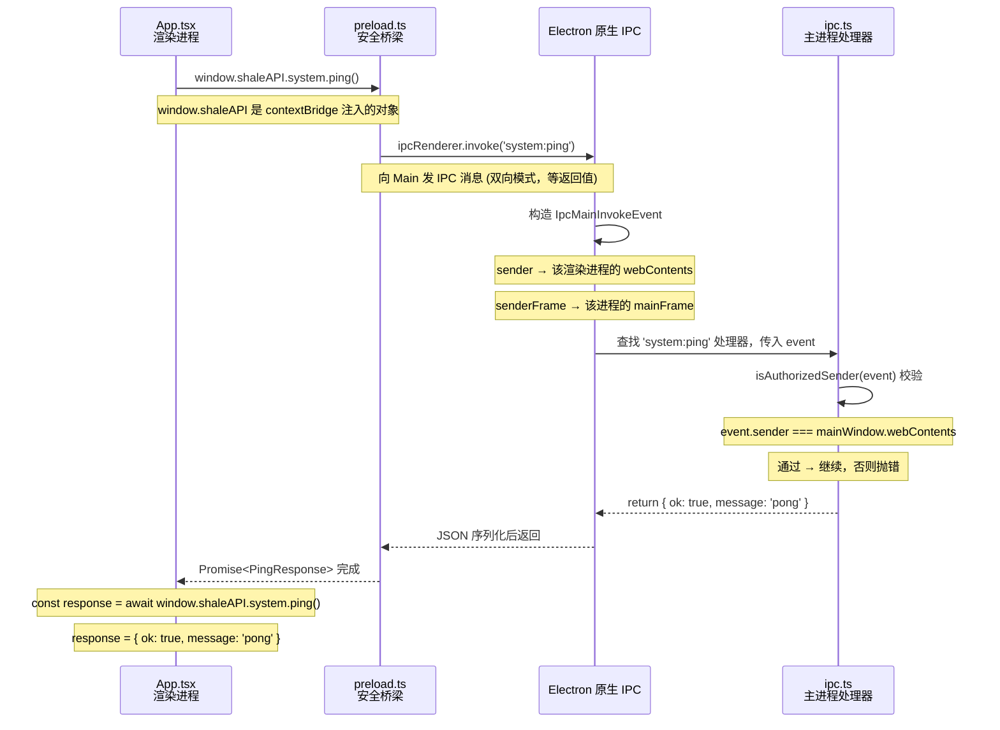
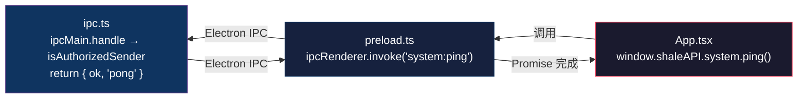

# IPC 数据流：从 Ping 理解 Shale 的跨进程通信

本文以 `ping` 为例，逐层跟踪一次 IPC 调用从渲染进程到主进程再返回的完整路径，帮助不熟悉 Electron IPC 或本项目架构的人理解全貌。

---

## 1. 先了解架构分层

下面这张图把 **Electron 原生提供的机制**（灰色虚线框）和 **本项目加的定制层**（彩色框）区分开来。

```mermaid
flowchart LR
    subgraph Renderer[Renderer 进程 — React]
        direction TB
        R1["· UI 与界面状态
· 无 Node.js 权限
· 通过 window.shaleAPI 调用功能"]
    end

    subgraph ProjectPreload[本项目定制 — Preload 桥梁]
        direction TB
        PP["· contextBridge 注入有限 API
· 不暴露完整 ipcRenderer
· 只暴露封装好的领域方法
· 类型：ShaleAPI"]
    end

    subgraph ElectronIPC["Electron 原生 — IPC 机制"]
        direction LR
        E1["ipcRenderer.invoke"] --- E2["通道路由/序列化"] --- E3["ipcMain.handle"]
    end

    subgraph ProjectMain[本项目定制 — Main 处理器]
        direction TB
        PM["· registerIpcHandlers
· isAuthorizedSender 安全校验
· 按领域分组管理"]
    end

    subgraph ElectronCore[Electron 原生 — 主进程能力]
        direction TB
        EC["· 窗口管理 BrowserWindow
· 完整 Node.js 权限
· 文件/数据库/网络"]
    end

    Renderer -->|1. 调用 window.shaleAPI| ProjectPreload
    ProjectPreload -->|2. 走 Electron IPC| ElectronIPC
    ElectronIPC -->|3. 派发到处理器| ProjectMain
    ProjectMain -->|4. 调用原生能力| ElectronCore
    ElectronCore -->|5. 返回结果| ProjectMain
    ProjectMain -->|6. IPC 返回| ElectronIPC
    ElectronIPC -->|7. 回到 Preload| ProjectPreload
    ProjectPreload -->|8. Promise 完成| Renderer

    style ElectronIPC fill:#3a3a3a,stroke:#888,color:#ccc,stroke-dasharray: 6 3
    style ElectronCore fill:#3a3a3a,stroke:#888,color:#ccc,stroke-dasharray: 6 3
    style ProjectPreload fill:#16213e,stroke:#0f3460,color:#fff
    style ProjectMain fill:#0f3460,stroke:#533483,color:#fff
    style Renderer fill:#1a1a2e,stroke:#e94560,color:#fff
```



### 一层一层看

| 层 | 谁提供的 | 源文件 | 职责 |
|---|---|---|---|
| **Renderer** | Electron | `src/renderer/App.tsx` | 渲染网页，无系统权限 |
| **Preload 桥梁**（本项目） | 项目代码 | `src/preload/preload.ts` | 在 contextBridge 上精心挑选可暴露的 API，不泄露完整 ipcRenderer |
| **Electron IPC**（灰色虚线框） | **Electron 原生** | 内置模块 `ipcMain` / `ipcRenderer` | 进程间消息路由、序列化/反序列化、通道匹配。**项目代码不碰这里** |
| **Main 处理器**（本项目） | 项目代码 | `src/main/ipc.ts` | 注册 ipcMain.handle，加安全校验（isAuthorizedSender），调真正的 Service |
| **Electron 主进程能力**（灰色虚线框） | **Electron 原生** | 内置模块 `app` / `BrowserWindow` | BrowserWindow、Node.js 原生能力 |

---

## 2. 代码全景

### 定义层 — 共享契约 (`src/shared/ipc.ts`)

```typescript
// IPC 通道名（类似"电话线路号"）
export const IPC_CHANNELS = {
  systemPing: 'system:ping',
} as const;

// 返回值类型约定
export type PingResponse = {
  ok: true;
  message: 'pong';
};

// API 接口约定 — 渲染进程能看到什么方法
export interface ShaleAPI {
  system: {
    ping: () => Promise<PingResponse>;
  };
}
```

### 桥梁定义 — Preload (`src/preload/preload.ts`)

```typescript
const ping = (): Promise<PingResponse> =>
  ipcRenderer.invoke(IPC_CHANNELS.systemPing);  // ← 走通道 'system:ping'

const shaleAPI: ShaleAPI = { system: { ping } };

contextBridge.exposeInMainWorld('shaleAPI', shaleAPI);
// ↑ 挂到 window.shaleAPI 上
```

### 实际干活 — Main 进程 (`src/main/ipc.ts`)

```typescript
export const registerIpcHandlers = (getMainWindow: GetMainWindow): void => {
  ipcMain.handle(IPC_CHANNELS.systemPing, (event): PingResponse => {
    // 1. 安全校验：确认消息来自主窗口
    if (!isAuthorizedSender(event, getMainWindow)) {
      throw new Error('Unauthorized IPC sender.');
    }
    // 2. 返回数据
    return { ok: true, message: 'pong' };
  });
};
```

### 调用方 — 渲染进程 (`src/renderer/App.tsx`)

```typescript
const testIpc = async (): Promise<void> => {
  // window.shaleAPI 是 preload 注入的
  const response = await window.shaleAPI.system.ping();
  // response = { ok: true, message: 'pong' }
};
```

### 类型声明 — 让 TypeScript 认识它 (`src/renderer/global.d.ts`)

```typescript
import type { ShaleAPI } from '../shared/ipc';

declare global {
  interface Window {
    shaleAPI: ShaleAPI;  // 扩充 Window 类型
  }
}
```

---

## 3. 逐帧跟踪：一次 Ping 调用的完整旅程



灰色背景的 **Electron 原生 IPC** 这一步对项目代码是透明的 —— `preload.ts` 只管调 `ipcRenderer.invoke`，`ipc.ts` 只管 `ipcMain.handle`，中间的消息路由、事件构造、序列化全由 Electron 自动完成。

---

## 4. 为什么不能直接调用 `ipcRenderer.invoke`？

如果你在 `App.tsx` 里直接写 `ipcRenderer.invoke(...)`：

```typescript
// ❌ 这行如果写在 App.tsx 会报错
const response = await ipcRenderer.invoke('system:ping');
```

原因：

1. **编译时不认识** — `ipcRenderer` 是 Electron 模块，Renderer 进程的 TypeScript 不会自动引入它
2. **运行时不存在** — `contextIsolation: true` 且 `nodeIntegration: false`，渲染进程的 `window` 上没有 Node.js 的任何东西
3. **安全架构不允许** — 项目约定渲染进程不能直接访问 Node.js / Electron API，必须通过 Preload 这个安全桥梁

Preload 脚本的作用就是：**挑选一小部分功能，用 `contextBridge` 安全地暴露给渲染进程**，而不是直接把整个 `ipcRenderer` 丢过去。

---

## 5. 什么是"通道"（Channel）

"通道"是 Electron IPC 的概念，直译自英文 **channel**。它是一个字符串名字，用来区分不同的 IPC 消息，**同一个 IPC 线路上可以有许多不同的通道**。

### 类比：总机电话

```
你打电话给公司总机  →  Electron IPC 线路
  拨 100 → 前台接     →  通道 'system:ping'
  拨 200 → 技术支持接  →  通道 'feed:fetch'
  拨 300 → 财务接     →  通道 'summary:generate'
```

IPC 线路只有一条（进程间通信的管道），但通过不同的通道名，消息能路由到不同的处理器。

### 代码里怎么看

```typescript
// shared/ipc.ts — 通道定义（相当于"电话簿"）
export const IPC_CHANNELS = {
  systemPing: 'system:ping',   // ← 这是一个通道
  // feedFetch: 'feed:fetch',  // ← 以后加另一个通道
};

// preload.ts — "拨号"方
ipcRenderer.invoke('system:ping')   // 指定通道名

// ipc.ts — "接听"方
ipcMain.handle('system:ping', ...)  // 监听同一个通道名
```

两端只要通道名对得上，消息就能送达。**一个通道名对应一类功能**，类似 REST API 里的 URL 路径（`GET /api/ping` vs `POST /api/feeds`）。

### 为什么叫"通道"

Electron 的英文文档里就叫 **channel**，`ipcRenderer.invoke(channel)` 和 `ipcMain.handle(channel, ...)` 的第一个参数都叫 `channel`，直译就是"通道"（也常叫"频道"）。

---

## 6. 关键设计要点

| 概念 | 说明 | 归属 |
|---|---|---|
| **IPC 通道** | `'system:ping'` — 一个字符串名字，两端约定好。类似"电话线路号"，preload 播这个号，Main 接这个号 | 项目约定于 `src/shared/` |
| **invoke/handle 模式** | 一问一答（Promise）。渲染进程等 Main 处理完再拿到结果 | Electron 原生 |
| **send/on 模式**（本项目暂未使用） | 单向通知，不需要返回值。发完即走 | Electron 原生 |
| **`contextBridge`** | Electron 的安全机制，在隔离的上下文中开一个小口，把受限的 API 注入到渲染进程的 `window` 上 | Electron 原生 |
| **`isAuthorizedSender`** | 安全校验：确保 IPC 消息只能来自主窗口的渲染进程，不能由其他窗口或脚本伪造 | 项目定制（`src/main/ipc.ts`） |
| **共享契约（Shared）** | 通道名、参数类型、返回类型在 `src/shared/` 定义，两端共用，保证类型一致 | 项目约定 |
| **ipcRenderer / ipcMain** | 发消息和收消息的 API 对象 | Electron 原生 |

---

## 7. 数据流示意图（精简版）



两端不直接对话，全程通过 **Electron 原生 IPC** 机制中转。Preload 是中间那个只开小门的"桥梁"，确保渲染进程不能越权。